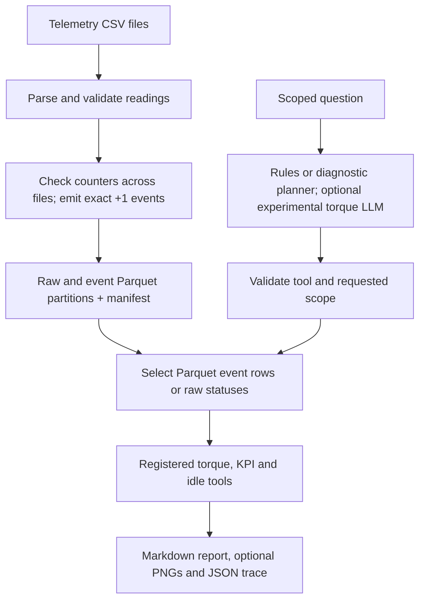

# AROL Telemetry AI

An industrial telemetry analysis project for an AROL capping machine. It converts timestamped, per-head counter readings into **observed closure events**, lets a scoped question select registered analyses, and produces a Markdown report with a JSON execution trace. The normal demo uses deterministic question routing; a local Ollama planner is available for a narrower set of torque questions.

> **Scope of the numbers:** An event represents an observed counter change of exactly `+1` between successive readings. Larger jumps and decreases are measured but are not reconstructed into individual closures. Results therefore describe **observed events**, not all physical production.

## Contents

- [Requirements and installation](#requirements-and-installation)
- [Run without private telemetry](#run-without-private-telemetry)
- [Prepare a real event pool](#prepare-a-real-event-pool)
- [Ask questions and inspect results](#ask-questions-and-inspect-results)
- [Architecture](#architecture)
- [Analysis tools](#analysis-tools)
- [Optional local LLM](#optional-local-llm)
- [Data definitions and limits](#data-definitions-and-limits)
- [Project layout and further reading](#project-layout-and-further-reading)
- [Troubleshooting](#troubleshooting)

## Requirements and installation

- Python **3.12** and `git`. The examples use a Unix/macOS shell; on Windows, activate `.venv` with the equivalent Windows command.
- Enough free disk space for your private CSV files and generated raw/event Parquet partitions if you plan to build a real pool. The repository does **not** include those private CSVs or built pools.
- Ollama and a downloaded model **only if** you choose the optional LLM planner. Rules routing, tests, and the controlled evaluation need no model.

From a new checkout:

```bash
git clone https://github.com/EddyKhoury/arol-telemetry-ai.git
cd arol-telemetry-ai
python3.12 -m venv .venv
.venv/bin/python -m pip install --upgrade pip
.venv/bin/python -m pip install -r requirements.txt
.venv/bin/python -m pytest tests -q
```

Run commands from the **repository root**. The project pins its Python packages in `requirements.txt`; its processing uses Polars and Parquet, tests use pytest, and configuration uses PyYAML. Running `pytest tests -q` selects the actual suite and avoids accidentally collecting backed-up test files stored elsewhere in a local working directory.

On Windows, substitute `.venv\Scripts\python` for `.venv/bin/python` in the commands below. If `python3.12` is unavailable, install Python 3.12 first and check `python3.12 --version`.

## Run without private telemetry

The full code tests and the small, controlled question evaluation work in a clean checkout:

```bash
.venv/bin/python -m pytest tests -q
.venv/bin/python -m scripts.evaluate_agent
.venv/bin/python -m scripts.evaluate_anomaly_ground_truth
```

The evaluator creates a tiny **synthetic two-file telemetry pool** with planted signals and four boundary events. It checks 28 fixed questions: 16 supported requests must produce the exact plan and result, and 12 requests must ask for clarification without loading event data. Results, synthetic files, reports, and traces are written locally; the score measures this controlled suite, **not** accuracy on arbitrary language or real production.

The separate anomaly evaluation uses [predeclared fixture labels](benchmarks/evaluation/anomaly_truth_v1.json) and two synthetic event pools. It matches returned flags to event IDs and reports true positives, false positives, missed labels, precision, recall and the false positive rate. The first case tests two planted torque limit breaches across a file boundary; the second includes a subtler in-range deviation. Results from the uploaded source ZIP: **TP=4, FP=0, FN=1, TN=59; precision=100%, recall=80%, false positive rate=0%**. These are scores on **synthetic torque-deviation labels**, not diagnoses of actual machine faults. See [the evaluation methods](docs/EVALUATION.md) and [the recorded evidence](benchmarks/integration/anomaly_ground_truth_v1.json).

For a committed, clean Git checkout, you can also run:

```bash
.venv/bin/python -m scripts.check_clean_checkout
```

This runs tests and the controlled evaluation from a temporary detached checkout with the current virtual environment. It requires `git status --short` to show no changes and does not test dependency installation, private telemetry, or a live model. In a previous release review the clean checkout reported **848 passed, 4 skipped**, then **28/28** controlled cases; these are recorded historical results, not promised counts for future revisions. Current results come from the commands you run.

## Prepare a real event pool

Place the original telemetry CSVs in a local directory under `data/`, for example `data/telemetry_...csv`. Keep filenames and their chronological order intact. Private CSVs and built pools under `data/` are ignored by Git and are **not downloaded** by this project. The CSV schema must provide `timestamp` and per-head `Count`, `AppTorque`, and `Status` columns.

Inspect the builder arguments, then create a **new** pool directory:

```bash
.venv/bin/python -m scripts.build_event_pool --help
.venv/bin/python -m scripts.build_event_pool \
  --machine-id MCC777eda3db57348ef8a3113a642ae74db \
  --pattern 'data/telemetry_MCC777eda3db57348ef8a3113a642ae74db_2026-*.csv' \
  --output data/event_pools/my-pool
```

Adjust the machine ID, glob, and output directory to your data. Quote the pattern so **the builder** receives it; its files are processed in sorted filename order. The example assumes files named like the supplied 2026 dataset. The output directory must not already exist. Building a large pool may take time and disk space; it is a separate operation from asking a question.

The builder validates whole-number counters before conversion, carries each head's previous observation across file boundaries, records jumps/decreases, and emits Parquet event partitions only for exact `+1` transitions. `data/event_pools/my-pool/manifest.json` is written when the build completes; a failed build may leave a partial directory without a complete manifest. An optional `--audit PATH` compares selected summary counts with an existing full counter audit; it does not independently validate every event field.

For the project's previously verified 89-file local dataset, the manifest recorded **7,623,968 raw rows**, **36 heads**, **54,722,936 observed exact `+1` events**, and **667 cross-file exact `+1` transitions**. These figures identify that specific local build, not the expected size of another dataset.

## Ask questions and inspect results

Start by printing questions with a machine ID and time window taken from *your* manifest:

```bash
.venv/bin/python -m scripts.demo_agent \
  --manifest data/event_pools/my-pool/manifest.json \
  --examples
```

Replace the manifest path below with your completed pool and adjust the machine, head, and dates to match. The window's start is **inclusive** and its end is **exclusive**:

```bash
.venv/bin/python -m scripts.demo_agent \
  --manifest data/event_pools/my-pool/manifest.json \
  --question 'Average torque for head 5 for machine MCC777eda3db57348ef8a3113a642ae74db from 2026-02-01T00:00:00 until 2026-02-01T12:00:00 for successful closures'
```

Other supported examples (using the same machine and time window):

```bash
.venv/bin/python -m scripts.demo_agent --manifest data/event_pools/my-pool/manifest.json \
  --question 'Success rate for head 5 for machine MCC777eda3db57348ef8a3113a642ae74db from 2026-02-01T00:00:00 until 2026-02-01T12:00:00'

.venv/bin/python -m scripts.demo_agent --manifest data/event_pools/my-pool/manifest.json \
  --question 'Success rate by hour for machine MCC777eda3db57348ef8a3113a642ae74db from 2026-02-01T00:30:00 until 2026-02-01T03:15:00'

.venv/bin/python -m scripts.demo_agent --manifest data/event_pools/my-pool/manifest.json \
  --question 'Compare head 5 with peers by cap-present success rate for machine MCC777eda3db57348ef8a3113a642ae74db from 2026-02-01T00:00:00 until 2026-02-01T12:00:00'

.venv/bin/python -m scripts.demo_agent --manifest data/event_pools/my-pool/manifest.json \
  --question 'Machine idle for machine MCC777eda3db57348ef8a3113a642ae74db from 2026-02-01T00:00:00 until 2026-02-01T01:00:00'
```

Omit `--question` for an interactive prompt (`exit` to leave); repeat `--question` for several reports. Pass `--json` with scripted questions to emit structured JSON, or `--output DIR` to change where sessions are saved. If exactly one complete pool exists under `data/event_pools/`, `--manifest` can be omitted; otherwise select it explicitly.

Add `--plots` when asking for a histogram, trend, time series, head KPI or
No Load intervals. It saves PNG figures from returned tool results and links
them in the Markdown report. See [three synthetic example reports](docs/samples/README.md)
or recreate them using `.venv/bin/python -m scripts.generate_sample_reports`.

Every question gets its own Markdown report and JSON trace under `data/demo_runs/session-.../question-.../`. The report states the filters, event population, definitions, numerical findings, and limits; the trace lists planning, loading, tool calls, and any clarification or error. Unsupported or ambiguous questions produce `needs_clarification` with **zero analysis tool calls**. For example, asking an unrelated general-knowledge question does not turn this project into a general chatbot. The CLI returns exit status `2` for a non-`ok` result, while still saving the report and trace.

For a local head check, run `.venv/bin/streamlit run scripts/web_demo.py` from the repository root and open the local URL it prints. The page clearly shows the selected machine. Ask `Is there any problem with head 4?` and it will request a bounded time window before reading events. With a window, it compares confirmed cap-present success against eligible peers and checks torque flags through registered tools. The short diagnostic answer and the detailed report state the observed evidence and why it cannot establish a yes/no fault verdict. The page exposes planned calls, the execution trace, and tool results. The same route is available in the CLI with `--planner diagnostic`, where the machine must be named in the question.

After changing backend Python files while Streamlit is running, restart the local server. A page rerun can retain an older imported planner module even while showing updated page code.

The source normally limits materialized events to **1,000,000** per request (`data.max_loaded_events`); narrow the machine, head, or time window when a query exceeds this limit. A peer comparison deliberately loads the other heads in the same machine/time window, because the specified head is the focus of the comparison.

## Architecture

The system has an **offline build path** and an **online question path**. The builder preserves validated observed events in a partitioned pool. The question path plans an analysis, reads only its supported scope, executes registered deterministic tools, and reports the result and its provenance.



| Stage | Main code | Responsibility |
| --- | --- | --- |
| CSV and event building | `src/ingestion/conversion.py`, `src/ingestion/event_pool.py`, `src/ingestion/event_table_polars.py`, `scripts/build_event_pool.py` | Parse raw columns, validate counters, carry prior rows across files, decode and save observed event partitions and manifest. |
| Question planning | `src/agent/planner.py`, `src/agent/*_routing.py`, `src/agent/llm_validation.py` | Select supported tools and exact parameters; reject ambiguous or changed scope before dispatch. |
| Scoped source | `src/common/event_pool_source.py`, `src/common/datasource.py`, `src/ingestion/adapter.py` | Validate the manifest, select relevant Parquet rows, preserve original event fields, and enforce the materialization limit. |
| Analysis | `src/common/registry.py`, `src/common/runtime.py`, `src/analytics/registered_*.py` | Validate tool arguments, apply the requested scope, run deterministic analytics and return structured results with units and counts. |
| Orchestration and output | `src/agent/orchestrator.py`, `src/agent/report.py`, `src/agent/trace.py`, `scripts/demo_agent.py` | Run the plan, record failures and timing, assemble a report, and save a trace. |

Person A implemented the CSV ingestion, observed event construction, and core torque analytics. Person B implemented the agent planner/orchestration, shared tool registry, reporting, traces, and related analyses. Their integration connects the partitioned event source to registered torque and explicit-denominator KPI tools. The separate project reference guides describe individual functions and ownership in greater detail.

## Analysis tools

| Question type | Registered tool(s) | What it reports |
| --- | --- | --- |
| Torque summary | `torque_stats` | Mean, minimum, maximum, sample standard deviation, and finite sample size. |
| Torque histogram | `torque_distribution` | Counts across specified bins. |
| Torque trend | `torque_trend` | Time-oriented torque summary. |
| Torque flags | `detect_torque_anomalies` | Configured limit and statistical flags; a flag does not identify a cause. |
| Two-head torque comparison | `head_correlation` | Matched observed torque pairs for two distinct heads. |
| Explicit KPI counts | `success_rate`, `success_rate_per_head` | Observed events, confirmed cap-present population, success and reject fractions, unknowns, and legacy fraction labelled separately. |
| Head ordering and peers | `rank_heads_by_success`, `compare_head_success` | Descriptive cap-present success ranking and focus-versus-peer median within one machine/time window. |
| Time buckets | `kpi_over_time`, `observed_throughput` | Hourly/daily counts and rates over requested durations, including clipped and empty intervals, plus a separate incremental mean of bucket rates. |
| All-head No Load | `machine_idle` | Candidate intervals where every raw status reading is No Load for the configured sustained duration. |

Some questions intentionally call two compatible tools in one scoped load, such as summary + histogram or total + per-head KPI. Those tools may use the *same* observations; their sample sizes must not be added together.

## Optional local LLM

The default `--planner rules` routes supported wording deterministically and needs no model. `--planner llm` talks to an Ollama server at `http://localhost:11434` using the model configured in `agent.llm.model` (default `qwen2.5-coder:14b`). You can override the model in a local `config.local.yaml`:

```yaml
agent:
  llm:
    model: qwen2.5-coder:14b
    fallback_to_rules: false
    timeout_seconds: 60
    temperature: 0
    seed: 42
```

Then check that Ollama is running and the chosen tag appears in `ollama list`, and ask one supported torque question:

```bash
.venv/bin/python -m scripts.demo_agent \
  --manifest data/event_pools/my-pool/manifest.json \
  --planner llm \
  --question 'Average torque for head 5 for machine MCC777eda3db57348ef8a3113a642ae74db from 2026-02-01T00:00:00 until 2026-02-01T01:00:00 for successful closures'
```

**Important:** `config.local.yaml` is not listed in the current `.gitignore`; keep local machine settings and any secrets out of commits. No API key is required for localhost Ollama. `--planner llm` is an **experimental torque planner** restricted to five verified single-tool torque analyses. Its existing scope validator rejects changed arguments, combined analyses, KPI questions, and head-health questions before data access. Transport fallback to rules, when enabled, is labelled in the trace. The website's head diagnostic is a separate evidence-based route and does not use this LLM mode.

## Data definitions and limits

| Term | Meaning in this project |
| --- | --- |
| Observed event | A head counter increased by exactly `1` since its previous observed reading, including across file boundaries. |
| Counter jump/decrease | A measured discontinuity; no missing individual closures are synthesized and no reset cause is assumed. |
| Successful closure | Status `0` in the decoded event schema. |
| Confirmed cap-present success rate | Successful, confirmed cap-present observed events divided by all confirmed cap-present observed events in the selected scope. Unknown cap presence is counted separately. |
| No Load fraction | No Load class observed events divided by all observed events in the same scope. This differs from the cap-present success rate. |
| Observed throughput | Observed event count divided by the **requested** interval duration; includes partial requested buckets. |
| Timestamps | Stored plant-local naive times; timezone and daylight-saving interpretation have not been confirmed. |

An empty time bucket means no **recorded** events there; it does not prove a machine was idle. A near-100% conditional cap-present success rate does not establish total production success, because No Load and missing/unreconstructed closures are different populations. Statistical torque flags and descriptive head rankings do not diagnose physical faults or prove engineering compliance. Values such as the configured torque bounds in `config.yaml` must be checked against confirmed process specifications before making engineering claims.

## Project layout and further reading

```text
config.yaml                 Shared configuration and illustrative thresholds
requirements.txt            Pinned Python dependencies
src/ingestion/              CSV validation, event detection, partitioned pool
src/analytics/              Torque analyses and explicit-denominator KPI tools
src/common/                 Schemas, registry, configuration, scoped source
src/agent/                  Planning, orchestration, reports and traces
scripts/                    Pool builder, demo, verification and evaluation CLIs
tests/                      Unit and integration tests
benchmarks/evaluation/      Fixed controlled question set
benchmarks/integration/     Saved verification summaries
docs/                       Demo, methods, audit and integration notes
data/                       Local raw files, pools and generated reports (ignored)
```

Start with [the demo guide](docs/DEMO.md) for presentation commands and [the 13-slide deck and rehearsal notes](docs/presentation/README.md). The [evaluation guide](docs/EVALUATION.md) describes the controlled methodology. The [methods and limits](docs/METHODS-AND-LIMITS.md) explain event identity, denominators, idle status and speed. See [the implementation audit](docs/PROJECT-AUDIT.md), [the integration tracker](docs/INTEGRATION-TRACKER.md), and [the event contract](docs/contract.md) for design decisions and boundaries. The [Person A](docs/PERSON-A-REFERENCE.md), [Person B](docs/PERSON-B-REFERENCE.md), and [integration](docs/INTEGRATION-REFERENCE.md) references provide function-by-function review guides; the Person A/B documents distinguish their original standalone work from the merged code.

## Troubleshooting

| Symptom | Check |
| --- | --- |
| `No input CSV files matched` | Check the CSV location and the quoted `--pattern` relative to the repository root. |
| `Output directory already exists` | Choose a new `--output` directory; the builder does not overwrite a prior build. |
| Missing or invalid manifest | Build a complete event pool or pass the correct path to `--manifest`. A fresh Git checkout has no private pool. |
| More than one pool present | Pass `--manifest data/event_pools/<pool>/manifest.json` explicitly. |
| Scope too large | Restrict the machine, head or time window. Peer comparisons need all selected peers. |
| Clarification needed / no tool calls | Give a supported telemetry analysis and explicit scope; the agent intentionally does not answer general questions or infer fault causes. |
| `pytest` import mismatch in backups | Run `.venv/bin/python -m pytest tests -q` from the root rather than discovering tests inside `data/`. |
| Local LLM unavailable | Verify Ollama is running and `ollama list` includes the configured model; use `--planner rules` for the verified default route. |

For reproducible reviews, record the Git commit, selected manifest, question, generated report, trace, and exact test/evaluation command. Real-data verification records are under `benchmarks/integration/`; generated session data under `data/` stay local.
