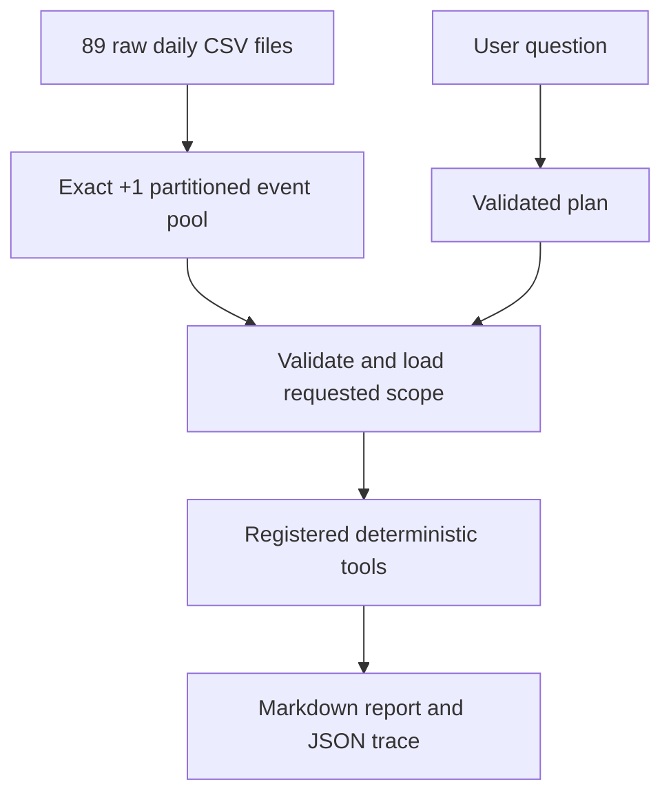

# Integrated system — how Person A and Person B work together

This is a code review reference for the integrated source. Its existing function inventory was written from an integrated source snapshot and cross-checked against the user's uploaded `arol-telemetry-ai-main(2).zip` on 2026-09-26; the inspected application modules matched. The ZIP does not contain Git metadata, so these references cannot assert a commit hash. The new anomaly evaluation and documentation were added after this inventory was compiled. The companion guides distinguish Person A and Person B's original contributions from their merged implementation.

## End-to-end workflow



- **Data definition:** count delta exactly +1 yields one observed closure event for a head. First observation establishes a baseline; the partitioned builder carries baselines between ordered files. Jumps larger than 1, holds and decreases remain measured diagnostic phenomena, not reconstructed individual closures.
- **Selection:** a plan specifies the machine, head, explicit start-inclusive/end-exclusive time bounds, status, bucket or comparison population where relevant. Invalid/missing scope is clarified before data load. The partitioned source applies lazy filters, a configured materialization limit and consistency checks.
- **Execution:** the registry dispatches to Python/Polars analytics. A model may propose a call for supported torque grammar but cannot invent tool arguments, change scope, send free-form prose as findings or do numeric calculations. Demo defaults to deterministic rules.
- **Reporting:** show observed counts, denominators, finite-torque sample size, contributing timestamps, tool calls, warnings, assumptions and actionable next checks. Two tools in one report can process the **same** events; do not add their sample sizes.
- **Boundaries:** no claim of complete physical closure counts, downtime, fault cause, calibrated engineering limits or arbitrary-language question accuracy. Timezone/DST and plant schedule remain unconfirmed.
- **Optional export review item:** the inspected integrated `Orchestrator.deliver` can request plots/HTML/PDF, but the reconstructed merged source snapshot does not contain the `src/interface` modules it imports for those paths. Default Markdown and trace delivery were verified. Check optional export availability against the exact final `main` checkout before demonstrating it; Person B's standalone checkout does contain those modules.

## Shared data and KPI semantics

| Term | Exact interpretation |
|---|---|
| Observed event | One exact +1 per-head counter transition in the supplied telemetry |
| Event columns from A | `ts`, `machine_id`, `head_id`, `torque`, `status`, `error_class`, `reject_signal`, `cap_present` |
| Additional adapter fields | `pool_id`, `head_index`, `count_delta=1`, `inferred=False` for these observed rows |
| Status 0 | Recorded successful closure |
| No Load status 2 | A recorded cycle with explicit cap absence; not part of the confirmed cap-present success denominator |
| Confirmed-cap rate | Successful status-0 rows / confirmed cap-present rows in the *same selected population* |
| All-observed fraction | Successful status-0 rows / all observed exact +1 rows; distinctly labelled |
| Unknown cap presence | Counted separately; neither proven present nor proven absent |
| Torque sample size | Only selected finite torque values; finite zeros remain eligible |
| Timestamps | Compared as stored; inclusive `start`, exclusive `end`; plant timezone unconfirmed |

## Provenance map

| Functionality | First codebase | What the integration added or changed |
|---|---|---|
| Wide telemetry loading and validation | Person A | Partitioned ordered event builder and preserved file-boundary baselines |
| Exact +1 closure detector and original torque analytics | Person A | Registered wrappers, explicit scope, controlled multi-tool plans |
| Event contract, registry, envelope, planner, trace and report | Person B | Preserved A's decoded columns; reject scope-changing model proposals and filter-relaxing retries |
| Standalone KPI logic and synthetic ground truth | Person B | Explicit confirmed-cap and unknown denominators; scoped head, peer, hourly/daily reports |
| Real-data use | Both originals provided pieces | `EventPoolSource` with manifest validation and bounded Parquet selection |
| Demo/evaluation/release review | Later integration | CLI, 28-case controlled evaluation and clean-checkout test command |

## Recorded verification and reproducible commands

The recorded private pool spans 89 CSV files, 7,623,968 raw rows, 36 heads, **54,722,936 observed exact +1 events** and **667 cross-file +1 transitions**. Real scoped queries were compared with independent calculations for torque, all five original torque routes, explicit KPIs, head comparisons, temporal buckets, and cross-file windows. On merged `main`, the local test run reported **852 passed**. In a clean detached checkout the test suite reported **848 passed and 4 skipped** (optional data/sibling checkout), and the controlled evaluation passed **28/28** (16 supported exact requests and 12 clarifications without loading). The controlled score is for fixed/planted cases, not arbitrary natural-language accuracy. One local Qwen request was accepted with exact scope and matching torque statistics; it is not a general live LLM benchmark.

```bash
.venv/bin/python -m pytest tests -q
.venv/bin/python -m scripts.check_clean_checkout
.venv/bin/python -m scripts.demo_agent --manifest data/event_pools/continuous-20260924-080513-930170/manifest.json --examples
```

The full raw CSVs and generated `data/event_pools` manifest/Parquet partitions live **locally** and are not committed. The clean checkout therefore checks code plus synthetic evaluation, not private real-data availability on another machine.

## Integration-owned and modified function reference

Functions and methods below are listed from the inspected Python source. Private helpers are included because they explain the data and validation paths. Parameter names and return annotations are taken from source; `not annotated` means the code does not declare a return type.

### `src/ingestion/event_pool.py`

Later integration: ordered per-file event builder carrying each head's previous counter across file boundaries, validating whole-number counters and writing a checked partition manifest.

- **`sha256_file`** ([`src/ingestion/event_pool.py`](../src/ingestion/event_pool.py#L24), line 24): Stream a file through SHA-256 and return its hex digest for partition integrity evidence. **Parameters:** `path`. **Return contract:** `not annotated`; see the implementation for structured fields and error cases.
- **`_convert_input`** ([`src/ingestion/event_pool.py`](../src/ingestion/event_pool.py#L32), line 32): Convert one raw CSV to Parquet when needed, then return its normalized processing path. **Parameters:** `path`, `destination`. **Return contract:** `not annotated`; see the implementation for structured fields and error cases.
- **`_integer_values`** ([`src/ingestion/event_pool.py`](../src/ingestion/event_pool.py#L53), line 53): Validate before casting: Polars casts alone can truncate floats. **Parameters:** `series`, `counter`. **Return contract:** `not annotated`; see the implementation for structured fields and error cases.
- **`_prepare`** ([`src/ingestion/event_pool.py`](../src/ingestion/event_pool.py#L73), line 73): Check ordered raw rows/head columns and build a typed per-file frame before counter arithmetic. **Parameters:** `raw`, `expected_heads`. **Return contract:** `not annotated`; see the implementation for structured fields and error cases.
- **`_counter_counts`** ([`src/ingestion/event_pool.py`](../src/ingestion/event_pool.py#L105), line 105): Classify per-head counter deltas into holds, exact +1, positive jumps and decreases, carrying the previous file baseline. **Parameters:** `frame`, `heads`, `previous`. **Return contract:** `not annotated`; see the implementation for structured fields and error cases.
- **`_timestamp_counts`** ([`src/ingestion/event_pool.py`](../src/ingestion/event_pool.py#L125), line 125): Count timestamp gaps relative to the prior row, including the preceding file's final timestamp. **Parameters:** `frame`, `previous`. **Return contract:** `not annotated`; see the implementation for structured fields and error cases.
- **`_iso`** ([`src/ingestion/event_pool.py`](../src/ingestion/event_pool.py#L139), line 139): Represent a datetime as ISO text for manifest and evidence output. **Parameters:** `value`. **Return contract:** `not annotated`; see the implementation for structured fields and error cases.
- **`build_event_pool`** ([`src/ingestion/event_pool.py`](../src/ingestion/event_pool.py#L143), line 143): Process ordered CSVs one at a time, carry one previous counter per discovered head across boundaries, write exact +1 event partitions and a summary manifest. **Parameters:** `csv_paths`, `output_dir`, `machine_id`, `progress`. **Return contract:** `not annotated`; see the implementation for structured fields and error cases.
- **`scan_event_pool`** ([`src/ingestion/event_pool.py`](../src/ingestion/event_pool.py#L270), line 270): Validate the completed manifest and present partitioned event Parquet as one lazy view; optional full hash checking. Return a lazy, globally ordered eight-column view of completed events. **Parameters:** `manifest_path`, `verify_hashes`. **Return contract:** `not annotated`; see the implementation for structured fields and error cases.

### `src/ingestion/adapter.py`

Integration change: preserve Person A's eight fields by default (`redecode=False`), add contract metadata, and disclose missing measurements.

- **`_status_range`** ([`src/ingestion/adapter.py`](../src/ingestion/adapter.py#L42), line 42): Validate raw status values against the adapter's documented integer range. **Parameters:** none. **Return contract:** `tuple[int, int]`; see the implementation for structured fields and error cases.
- **`_head_index`** ([`src/ingestion/adapter.py`](../src/ingestion/adapter.py#L50), line 50): 'H07' -> 7. Falls back to null rather than guessing on an odd id. **Parameters:** `expr`. **Return contract:** `pl.Expr`; see the implementation for structured fields and error cases.
- **`adapt`** ([`src/ingestion/adapter.py`](../src/ingestion/adapter.py#L55), line 55): Convert one of Person A's event tables to the contract. **Parameters:** `events`, `pool_id`, `redecode`. **Return contract:** `tuple[pl.DataFrame, list[str]]`; see the implementation for structured fields and error cases.
- **`describe`** ([`src/ingestion/adapter.py`](../src/ingestion/adapter.py#L135), line 135): Build the pool_meta dict the report's 'data used' section reads. **Parameters:** `frame`, `pool_id`, `notes`, `source`, `timezone`. **Return contract:** `dict`; see the implementation for structured fields and error cases.

### `src/analytics/event_filters.py`

Later integration: validate and apply explicit machine/head/time limits; start inclusive and end exclusive.

- **`_bound`** ([`src/analytics/event_filters.py`](../src/analytics/event_filters.py#L7), line 7): Parse one explicit ISO datetime bound; reject invalid or timezone-incompatible values before filtering. **Parameters:** `value`. **Return contract:** `not annotated`; see the implementation for structured fields and error cases.
- **`filter_events`** ([`src/analytics/event_filters.py`](../src/analytics/event_filters.py#L20), line 20): Apply explicit start-inclusive/end-exclusive timestamp, head and machine filters and record applied constraints. **Parameters:** `events`, `start`, `end`, `head_id`, `machine_id`. **Return contract:** `not annotated`; see the implementation for structured fields and error cases.

### `src/analytics/registered_torque.py`

Later integration: register Person A's torque statistics as a tool with result/sample metadata and unchanged underlying arithmetic.

- **`registered_torque_stats`** ([`src/analytics/registered_torque.py`](../src/analytics/registered_torque.py#L25), line 25): Apply explicit event scope and optional successful-status filter, delegate arithmetic to A's `torque_stats`, and return an envelope. **Parameters:** `events`, `status_filter`, `start`, `end`, `head_id`, `machine_id`. **Return contract:** `not annotated`; see the implementation for structured fields and error cases.

### `src/analytics/registered_analytics.py`

Later integration: registry wrappers for Person A's histogram, drift, torque-anomaly and paired-head analytics.

- **`_finish`** ([`src/analytics/registered_analytics.py`](../src/analytics/registered_analytics.py#L24), line 24): Build a successful analytics envelope with contributing window, applied filters, units and limitations. **Parameters:** `result`, `scoped`, `applied`, `status_filter`, `units`, `notes`. **Return contract:** `not annotated`; see the implementation for structured fields and error cases.
- **`registered_distribution`** ([`src/analytics/registered_analytics.py`](../src/analytics/registered_analytics.py#L41), line 41): Scope events and delegate histogram calculation to A's `torque_distribution`. **Parameters:** `events`, `bins`, `status_filter`, `start`, `end`, `head_id`, `machine_id`. **Return contract:** `not annotated`; see the implementation for structured fields and error cases.
- **`registered_trend`** ([`src/analytics/registered_analytics.py`](../src/analytics/registered_analytics.py#L59), line 59): Scope events and delegate trend calculation to A's `torque_trend` with trusted configured drift window. **Parameters:** `events`, `status_filter`, `start`, `end`, `head_id`, `machine_id`. **Return contract:** `not annotated`; see the implementation for structured fields and error cases.
- **`registered_anomalies`** ([`src/analytics/registered_analytics.py`](../src/analytics/registered_analytics.py#L81), line 81): Scope events and delegate configured threshold/statistical torque flags to A's anomaly detector. **Parameters:** `events`, `status_filter`, `start`, `end`, `head_id`, `machine_id`. **Return contract:** `not annotated`; see the implementation for structured fields and error cases.
- **`registered_head_correlation`** ([`src/analytics/registered_analytics.py`](../src/analytics/registered_analytics.py#L105), line 105): Check distinct heads, one machine, unique timestamps and exact matching, then delegate to A's paired-head comparison. **Parameters:** `events`, `head_a`, `head_b`, `start`, `end`, `machine_id`. **Return contract:** `not annotated`; see the implementation for structured fields and error cases.

### `src/analytics/registered_kpi.py`

Later integration: explicit observed, cap-present, unknown-cap and No Load denominators; separate legacy A fraction, and an overview/per-head tool.

- **`_sum`** ([`src/analytics/registered_kpi.py`](../src/analytics/registered_kpi.py#L23), line 23): Count true values in a nullable Polars Boolean expression, treating null as false for that explicit count. **Parameters:** `expr`, `name`. **Return contract:** `not annotated`; see the implementation for structured fields and error cases.
- **`_aggregations`** ([`src/analytics/registered_kpi.py`](../src/analytics/registered_kpi.py#L27), line 27): Build count expressions for all observed, cap-present/absent/unknown, success, reject and No Load populations. **Parameters:** none. **Return contract:** `not annotated`; see the implementation for structured fields and error cases.
- **`finish_counts`** ([`src/analytics/registered_kpi.py`](../src/analytics/registered_kpi.py#L50), line 50): Turn validated grouped counts into explicitly named rates; leave rates null for zero denominators. Rates remain null for an empty denominator; counts always remain visible. **Parameters:** `counts`, `min_n`. **Return contract:** `not annotated`; see the implementation for structured fields and error cases.
- **`_prepare`** ([`src/analytics/registered_kpi.py`](../src/analytics/registered_kpi.py#L71), line 71): Apply shared scope, validate required schema and types, collect selected rows and read trusted min_n. **Parameters:** `events`, `start`, `end`, `head_id`, `machine_id`. **Return contract:** `not annotated`; see the implementation for structured fields and error cases.
- **`_calculate`** ([`src/analytics/registered_kpi.py`](../src/analytics/registered_kpi.py#L93), line 93): Prepare the selected event frame, compute overall/per-head counts and attach definitions, limits and an envelope. **Parameters:** `events`, `per_head`, `start`, `end`, `head_id`, `machine_id`. **Return contract:** `not annotated`; see the implementation for structured fields and error cases.
- **`success_rate`** ([`src/analytics/registered_kpi.py`](../src/analytics/registered_kpi.py#L114), line 114): Summarize success, reject, No Load and cap-presence counts and rates for the selected population. **Parameters:** `events`, `start`, `end`, `head_id`, `machine_id`. **Return contract:** `not annotated`; see the implementation for structured fields and error cases.
- **`success_rate_per_head`** ([`src/analytics/registered_kpi.py`](../src/analytics/registered_kpi.py#L119), line 119): Group the same KPI calculations by machine and head, exposing each group's denominator. **Parameters:** `events`, `start`, `end`, `head_id`, `machine_id`. **Return contract:** `not annotated`; see the implementation for structured fields and error cases.

### `src/analytics/registered_head_kpi.py`

Later integration: rank heads and compare a focus head to other eligible heads in exactly one machine/time population; descriptive only.

- **`validate_population`** ([`src/analytics/registered_head_kpi.py`](../src/analytics/registered_head_kpi.py#L14), line 14): Reject missing machine or invalid/empty time window and verify canonical focus head ID. **Parameters:** `machine_id`, `start`, `end`, `head_id`. **Return contract:** `not annotated`; see the implementation for structured fields and error cases.
- **`_rate`** ([`src/analytics/registered_head_kpi.py`](../src/analytics/registered_head_kpi.py#L26), line 26): Represent a head's success fraction as an exact rational number to avoid floating-point tie errors. **Parameters:** `row`. **Return contract:** `not annotated`; see the implementation for structured fields and error cases.
- **`rank_counts`** ([`src/analytics/registered_head_kpi.py`](../src/analytics/registered_head_kpi.py#L30), line 30): Filter heads below min_n and assign ascending competition ranks using exact fractions and stable head ordering. Competition ranks use exact ratios: ties get equal ranks (1, 1, 3). **Parameters:** `rows`, `min_n`. **Return contract:** `not annotated`; see the implementation for structured fields and error cases.
- **`compare_with_peers`** ([`src/analytics/registered_head_kpi.py`](../src/analytics/registered_head_kpi.py#L60), line 60): Compare a focus head with the unweighted median of at least two other eligible heads; explain unavailable comparisons. Unweighted median across eligible OTHER heads, requiring two peers. **Parameters:** `ranked`, `head_id`. **Return contract:** `not annotated`; see the implementation for structured fields and error cases.
- **`_run`** ([`src/analytics/registered_head_kpi.py`](../src/analytics/registered_head_kpi.py#L81), line 81): Calculate all heads in the same machine/time scope, rank eligible ratios, and optionally compare the focus with other heads. **Parameters:** `events`, `machine_id`, `start`, `end`, `head_id`. **Return contract:** `not annotated`; see the implementation for structured fields and error cases.
- **`rank_heads_by_success`** ([`src/analytics/registered_head_kpi.py`](../src/analytics/registered_head_kpi.py#L112), line 112): Compute descriptive eligible-head success ordering within the selected machine and time window. **Parameters:** `events`, `machine_id`, `start`, `end`. **Return contract:** `not annotated`; see the implementation for structured fields and error cases.
- **`compare_head_success`** ([`src/analytics/registered_head_kpi.py`](../src/analytics/registered_head_kpi.py#L117), line 117): Compare the selected focus head with eligible peers in the same machine/time population. **Parameters:** `events`, `machine_id`, `start`, `end`, `head_id`. **Return contract:** `not annotated`; see the implementation for structured fields and error cases.

### `src/analytics/registered_temporal_kpi.py`

Later integration: hourly/daily KPI and observed-throughput buckets with clipped requested-window durations; empty buckets are not downtime claims.

- **`bucket_grid`** ([`src/analytics/registered_temporal_kpi.py`](../src/analytics/registered_temporal_kpi.py#L19), line 19): Generate requested-window clipped hourly/daily intervals, including empty buckets, and enforce maximum bucket count. **Parameters:** `start`, `end`, `bucket`, `max_buckets`. **Return contract:** `not annotated`; see the implementation for structured fields and error cases.
- **`validate_request`** ([`src/analytics/registered_temporal_kpi.py`](../src/analytics/registered_temporal_kpi.py#L46), line 46): Require one machine and generate a bounded hourly/daily grid inside the explicit request window. **Parameters:** `machine_id`, `start`, `end`, `bucket`, `max_buckets`. **Return contract:** `not annotated`; see the implementation for structured fields and error cases.
- **`add_observed_rates`** ([`src/analytics/registered_temporal_kpi.py`](../src/analytics/registered_temporal_kpi.py#L52), line 52): Divide observed/cap-present/success counts by the entire requested interval duration to express hourly event rates. **Parameters:** `counts`, `seconds`. **Return contract:** `not annotated`; see the implementation for structured fields and error cases.
- **`_run`** ([`src/analytics/registered_temporal_kpi.py`](../src/analytics/registered_temporal_kpi.py#L61), line 61): Validate explicit machine/time/bucket and maximum grid, aggregate each bucket, reconcile totals and produce a rate envelope. **Parameters:** `events`, `machine_id`, `start`, `end`, `bucket`, `head_id`, `throughput`. **Return contract:** `not annotated`; see the implementation for structured fields and error cases.
- **`kpi_over_time`** ([`src/analytics/registered_temporal_kpi.py`](../src/analytics/registered_temporal_kpi.py#L104), line 104): Aggregate explicit-denominator KPI counts in validated hourly/daily buckets and preserve partial intervals. **Parameters:** `events`, `machine_id`, `start`, `end`, `bucket`, `head_id`. **Return contract:** `not annotated`; see the implementation for structured fields and error cases.
- **`observed_throughput`** ([`src/analytics/registered_temporal_kpi.py`](../src/analytics/registered_temporal_kpi.py#L109), line 109): Aggregate observed exact +1 event counts and requested-duration-normalized rates across hourly/daily buckets. **Parameters:** `events`, `machine_id`, `start`, `end`, `bucket`, `head_id`. **Return contract:** `not annotated`; see the implementation for structured fields and error cases.

### `src/common/event_pool_source.py`

Later integration: validate planned scope and manifest, apply lazy Parquet filters, count before collecting, cap materialization size, recheck pool stability, and pass events through the adapter.

- **`_read_parameters`** ([`src/common/event_pool_source.py`](../src/common/event_pool_source.py#L21), line 21): Validate one named planned tool and its canonical typed arguments; infer exact read scope before opening files. **Parameters:** `calls`. **Return contract:** `not annotated`; see the implementation for structured fields and error cases.
- **`_read_plan`** ([`src/common/event_pool_source.py`](../src/common/event_pool_source.py#L71), line 71): Validate allowed one- or two-tool plans and require identical data scopes across combined tools. **Parameters:** `calls`. **Return contract:** `not annotated`; see the implementation for structured fields and error cases.
- **`_stat_signature`** ([`src/common/event_pool_source.py`](../src/common/event_pool_source.py#L83), line 83): Record each Parquet partition's path, size and modification time to detect a change during a scoped read. **Parameters:** `paths`. **Return contract:** `not annotated`; see the implementation for structured fields and error cases.
- **`EventPoolSource.__init__`** ([`src/common/event_pool_source.py`](../src/common/event_pool_source.py#L96), line 96): Initialize this component with its required configuration and dependencies; constructor does not compute a user-facing result. **Parameters:** `cfg`, `repo_root`. **Return contract:** `not annotated`; see the implementation for structured fields and error cases.
- **`EventPoolSource.list_pools`** ([`src/common/event_pool_source.py`](../src/common/event_pool_source.py#L109), line 109): Return configured manifest-backed pools in sorted order without scanning events. **Parameters:** none. **Return contract:** `not annotated`; see the implementation for structured fields and error cases.
- **`EventPoolSource.load_for_plan`** ([`src/common/event_pool_source.py`](../src/common/event_pool_source.py#L112), line 112): Validate permitted tool/scope combinations, filter lazily, enforce row limits and pool stability, then adapt and return only selected events plus metadata. **Parameters:** `pool`, `calls`. **Return contract:** `not annotated`; see the implementation for structured fields and error cases.

### `src/common/datasource.py`

Integration selector for single-Parquet PersonASource or partitioned EventPoolSource; source data are not loaded until the plan is validated.

- **`PersonASource.__init__`** ([`src/common/datasource.py`](../src/common/datasource.py#L18), line 18): Initialize this component with its required configuration and dependencies; constructor does not compute a user-facing result. **Parameters:** `cfg`. **Return contract:** `not annotated`; see the implementation for structured fields and error cases.
- **`PersonASource.list_pools`** ([`src/common/datasource.py`](../src/common/datasource.py#L29), line 29): Return configured pool names for this source, without loading event frames. **Parameters:** none. **Return contract:** `not annotated`; see the implementation for structured fields and error cases.
- **`PersonASource._get`** ([`src/common/datasource.py`](../src/common/datasource.py#L33), line 33): Resolve configured single-file Parquet path, load once and adapt events without altering A's decoded fields. **Parameters:** `pool`. **Return contract:** `not annotated`; see the implementation for structured fields and error cases.
- **`PersonASource.load_pool`** ([`src/common/datasource.py`](../src/common/datasource.py#L59), line 59): Read and concatenate pool files in declared order into one raw frame; adjacent files form a continuous sequence. **Parameters:** `pool`. **Return contract:** `not annotated`; see the implementation for structured fields and error cases.
- **`PersonASource.pool_meta`** ([`src/common/datasource.py`](../src/common/datasource.py#L62), line 62): Describe the pool size, head/machine population, window and limitations for reports. **Parameters:** `pool`. **Return contract:** `not annotated`; see the implementation for structured fields and error cases.
- **`get_source`** ([`src/common/datasource.py`](../src/common/datasource.py#L76), line 76): Select the data-source implementation named in configuration. **Parameters:** `cfg`. **Return contract:** `not annotated`; see the implementation for structured fields and error cases.

### `src/common/runtime.py`

Trusted per-dispatch configuration supplied to tools separately from language-model arguments.

- **`current_config`** ([`src/common/runtime.py`](../src/common/runtime.py#L12), line 12): Return trusted per-dispatch settings from the runtime context, separate from planner-controlled arguments. **Parameters:** none. **Return contract:** `not annotated`; see the implementation for structured fields and error cases.
- **`dispatch_tool`** ([`src/common/runtime.py`](../src/common/runtime.py#L19), line 19): Supply trusted runtime config and event data independently of model-visible tool arguments. **Parameters:** `name`, `events`, `config`, `arguments`. **Return contract:** `not annotated`; see the implementation for structured fields and error cases.

### `src/common/registry.py`

Extended Person B registry with integrated analytics/KPI tool definitions; retains envelope and dispatch contract.

- **`ToolSpec.__init__`** ([`src/common/registry.py`](../src/common/registry.py#L84), line 84): Initialize this component with its required configuration and dependencies; constructor does not compute a user-facing result. **Parameters:** `fn`, `name`, `description`, `params`, `agent`, `owner`, `required`. **Return contract:** `not annotated`; see the implementation for structured fields and error cases.
- **`ToolSpec.json_schema`** ([`src/common/registry.py`](../src/common/registry.py#L95), line 95): The tool definition handed to an LLM for function calling. **Parameters:** none. **Return contract:** `dict`; see the implementation for structured fields and error cases.
- **`tool`** ([`src/common/registry.py`](../src/common/registry.py#L110), line 110): Register an analysis function as an agent-callable tool. **Parameters:** `name`, `description`, `params`, `agent`, `owner`, `required`. **Return contract:** `not annotated`; see the implementation for structured fields and error cases.
- **`tool.<locals>.decorate`** ([`src/common/registry.py`](../src/common/registry.py#L118), line 118): Attach the declared tool metadata and register the wrapped function under its canonical name. **Parameters:** `fn`. **Return contract:** `Callable`; see the implementation for structured fields and error cases.
- **`normalise_params`** ([`src/common/registry.py`](../src/common/registry.py#L136), line 136): Map aliases onto canonical names. Returns (params, renames_applied). **Parameters:** `params`. **Return contract:** `tuple[dict, list[str]]`; see the implementation for structured fields and error cases.
- **`_coerce_one`** ([`src/common/registry.py`](../src/common/registry.py#L161), line 161): Coerce one value to its declared JSON-Schema type. **Parameters:** `key`, `value`, `declared`. **Return contract:** `not annotated`; see the implementation for structured fields and error cases.
- **`coerce_params`** ([`src/common/registry.py`](../src/common/registry.py#L217), line 217): Enforce the types the tool schemas advertise to the planner. **Parameters:** `params`. **Return contract:** `tuple[dict, list[str], list[str]]`; see the implementation for structured fields and error cases.
- **`get_tool_specs`** ([`src/common/registry.py`](../src/common/registry.py#L274), line 274): Tool definitions for the planner, optionally filtered to one agent. **Parameters:** `agent`. **Return contract:** `list[dict]`; see the implementation for structured fields and error cases.
- **`list_tools`** ([`src/common/registry.py`](../src/common/registry.py#L280), line 280): Return names of registered tools available for inspection or planning. **Parameters:** none. **Return contract:** `list[str]`; see the implementation for structured fields and error cases.
- **`get`** ([`src/common/registry.py`](../src/common/registry.py#L284), line 284): Look up a registered tool or retrieve a nested config value, depending on the module. **Parameters:** `name`. **Return contract:** `not annotated`; see the implementation for structured fields and error cases.
- **`call_tool`** ([`src/common/registry.py`](../src/common/registry.py#L288), line 288): Call a registered deterministic function and return a JSON-safe success/failure envelope instead of propagating tool errors. Invoke a registered tool and guarantee a well-formed envelope. **Parameters:** `name`, `events`, `**params`. **Return contract:** `dict`; see the implementation for structured fields and error cases.

### `src/agent/torque_routing.py`

Later integration: deterministic grammar for the five registered torque analyses and constrained combined requests.

- **`_parse_canonical_torque_request`** ([`src/agent/torque_routing.py`](../src/agent/torque_routing.py#L11), line 11): Return None for other domains, or a plan dictionary for torque queries. **Parameters:** `query`. **Return contract:** `not annotated`; see the implementation for structured fields and error cases.
- **`_parse_canonical_torque_request.<locals>.clarify`** ([`src/agent/torque_routing.py`](../src/agent/torque_routing.py#L17), line 17): Return a structured clarification without tool calls for an unsupported or ambiguous request. **Parameters:** none. **Return contract:** `not annotated`; see the implementation for structured fields and error cases.
- **`parse_torque_request`** ([`src/agent/torque_routing.py`](../src/agent/torque_routing.py#L133), line 133): Recognize supported torque requests, including approved diagnostic aliases, and return a verified plan or clarification. Recognise diagnostic phrases, then validate the entire remaining scope. **Parameters:** `query`. **Return contract:** `not annotated`; see the implementation for structured fields and error cases.

### `src/agent/diagnostic_routing.py`

Later integration: anchored diagnostic aliases rewritten into verified torque requests or clarified when unsupported.

- **`_clarify`** ([`src/agent/diagnostic_routing.py`](../src/agent/diagnostic_routing.py#L10), line 10): Return a structured clarification plan for unsupported or ambiguous diagnostic phrasing. **Parameters:** `reason`. **Return contract:** `not annotated`; see the implementation for structured fields and error cases.
- **`rewrite_diagnostic_question`** ([`src/agent/diagnostic_routing.py`](../src/agent/diagnostic_routing.py#L18), line 18): Rewrite known diagnostic wording into supported exact torque analyses; clarify unsupported diagnostics. Return a rewrite descriptor, a clarification, or None for no match. **Parameters:** `text`. **Return contract:** `not annotated`; see the implementation for structured fields and error cases.

### `src/agent/kpi_routing.py`

Later integration: strict routing for explicit-denominator KPI questions.

- **`parse_kpi_request`** ([`src/agent/kpi_routing.py`](../src/agent/kpi_routing.py#L6), line 6): Parse only the explicitly supported KPI phrasings and required scope into a plan. **Parameters:** `query`. **Return contract:** `not annotated`; see the implementation for structured fields and error cases.
- **`parse_kpi_request.<locals>.clarify`** ([`src/agent/kpi_routing.py`](../src/agent/kpi_routing.py#L12), line 12): Return a structured clarification without tool calls for an unsupported or ambiguous request. **Parameters:** none. **Return contract:** `not annotated`; see the implementation for structured fields and error cases.

### `src/agent/head_kpi_routing.py`

Later integration: bounded machine/time peer comparisons and head ranking.

- **`parse_head_kpi_request`** ([`src/agent/head_kpi_routing.py`](../src/agent/head_kpi_routing.py#L6), line 6): Require one machine, time window and explicit comparison metric before ranking/peer analysis. **Parameters:** `query`. **Return contract:** `not annotated`; see the implementation for structured fields and error cases.
- **`parse_head_kpi_request.<locals>.clarify`** ([`src/agent/head_kpi_routing.py`](../src/agent/head_kpi_routing.py#L13), line 13): Return a structured clarification without tool calls for an unsupported or ambiguous request. **Parameters:** none. **Return contract:** `not annotated`; see the implementation for structured fields and error cases.

### `src/agent/temporal_kpi_routing.py`

Later integration: explicit bounded hourly or daily KPI/throughput questions.

- **`parse_temporal_kpi_request`** ([`src/agent/temporal_kpi_routing.py`](../src/agent/temporal_kpi_routing.py#L6), line 6): Require a bounded requested window and hour/day bucket before temporal KPI or throughput analysis. **Parameters:** `query`. **Return contract:** `not annotated`; see the implementation for structured fields and error cases.
- **`parse_temporal_kpi_request.<locals>.clarify`** ([`src/agent/temporal_kpi_routing.py`](../src/agent/temporal_kpi_routing.py#L17), line 17): Return a structured clarification without tool calls for an unsupported or ambiguous request. **Parameters:** none. **Return contract:** `not annotated`; see the implementation for structured fields and error cases.

### `src/agent/llm_validation.py`

Later integration: accept a native tool call or one complete JSON proposal only after exact schema and scope validation; prose is never a finding.

- **`_json_object`** ([`src/agent/llm_validation.py`](../src/agent/llm_validation.py#L11), line 11): Reject duplicate JSON object keys instead of letting a model overwrite a proposed tool argument. **Parameters:** `pairs`. **Return contract:** `not annotated`; see the implementation for structured fields and error cases.
- **`_proposal_message`** ([`src/agent/llm_validation.py`](../src/agent/llm_validation.py#L20), line 20): Accept one complete JSON text object only when native model tool calls are absent; never parse ordinary prose for JSON fragments. Accept one complete JSON proposal only when native calls are absent. **Parameters:** `message`. **Return contract:** `not annotated`; see the implementation for structured fields and error cases.
- **`strict_calls`** ([`src/agent/llm_validation.py`](../src/agent/llm_validation.py#L50), line 50): Require one schema-valid registered tool proposal whose typed arguments exactly match the verified requested scope. Require one registered, verified tool with canonical, typed parameters. **Parameters:** `message`, `lookup`. **Return contract:** `not annotated`; see the implementation for structured fields and error cases.

### `src/agent/planner.py`

Integration change: constrain local Ollama proposals to the verified deterministic grammar; unrecognized scope is clarified before data loading.

- **`Planner.plan`** ([`src/agent/planner.py`](../src/agent/planner.py#L40), line 40): Turn a user question into a named list of tool calls and arguments, or a request for clarification. **Parameters:** `query`, `context`. **Return contract:** `Plan`; see the implementation for structured fields and error cases.
- **`parse_intent`** ([`src/agent/planner.py`](../src/agent/planner.py#L80), line 80): Extract the intent name and any filters the query pins down. **Parameters:** `query`. **Return contract:** `tuple[str, dict]`; see the implementation for structured fields and error cases.
- **`_plan_torque_stats`** ([`src/agent/planner.py`](../src/agent/planner.py#L110), line 110): Compatibility hook for complete deterministic torque routing. **Parameters:** `query`. **Return contract:** `not annotated`; see the implementation for structured fields and error cases.
- **`RulePlanner.plan`** ([`src/agent/planner.py`](../src/agent/planner.py#L124), line 124): Turn a user question into a named list of tool calls and arguments, or a request for clarification. **Parameters:** `query`, `context`. **Return contract:** `Plan`; see the implementation for structured fields and error cases.
- **`_to_ollama_tools`** ([`src/agent/planner.py`](../src/agent/planner.py#L192), line 192): registry's Anthropic-style specs -> the OpenAI/Ollama function shape. **Parameters:** `specs`. **Return contract:** `list[dict]`; see the implementation for structured fields and error cases.
- **`LLMPlanner.__init__`** ([`src/agent/planner.py`](../src/agent/planner.py#L212), line 212): Initialize this component with its required configuration and dependencies; constructor does not compute a user-facing result. **Parameters:** `cfg`. **Return contract:** `not annotated`; see the implementation for structured fields and error cases.
- **`LLMPlanner._chat`** ([`src/agent/planner.py`](../src/agent/planner.py#L227), line 227): One non-streaming call to Ollama. Overridden in tests. **Parameters:** `query`, `tools`. **Return contract:** `dict`; see the implementation for structured fields and error cases.
- **`LLMPlanner.available`** ([`src/agent/planner.py`](../src/agent/planner.py#L248), line 248): Check that the configured local Ollama server and requested model tag are available. Require the configured model tag, allowing Ollama's implicit :latest. **Parameters:** none. **Return contract:** `bool`; see the implementation for structured fields and error cases.
- **`LLMPlanner.plan`** ([`src/agent/planner.py`](../src/agent/planner.py#L261), line 261): Turn a user question into a named list of tool calls and arguments, or a request for clarification. **Parameters:** `query`, `context`. **Return contract:** `Plan`; see the implementation for structured fields and error cases.
- **`LLMPlanner._reject`** ([`src/agent/planner.py`](../src/agent/planner.py#L313), line 313): Return a no-tool clarification when a model's proposal cannot be verified exactly. **Parameters:** `reason`. **Return contract:** `not annotated`; see the implementation for structured fields and error cases.
- **`LLMPlanner._extract_calls`** ([`src/agent/planner.py`](../src/agent/planner.py#L325), line 325): Extract native model tool calls (or validated structured proposals in the merged agent) and reject unsupported requests. **Parameters:** `message`. **Return contract:** `not annotated`; see the implementation for structured fields and error cases.
- **`get_planner`** ([`src/agent/planner.py`](../src/agent/planner.py#L331), line 331): Select deterministic rules or the configured Ollama planner. **Parameters:** `cfg`. **Return contract:** `Planner`; see the implementation for structured fields and error cases.

### `src/agent/orchestrator.py`

Integration change: select one pool, verify plan, load only needed events, dispatch approved tools, render and trace without widening user scope.

- **`Orchestrator.__init__`** ([`src/agent/orchestrator.py`](../src/agent/orchestrator.py#L19), line 19): Initialize this component with its required configuration and dependencies; constructor does not compute a user-facing result. **Parameters:** `cfg`, `source`, `planner`. **Return contract:** `not annotated`; see the implementation for structured fields and error cases.
- **`Orchestrator.answer`** ([`src/agent/orchestrator.py`](../src/agent/orchestrator.py#L28), line 28): Plan the question, select the pool, run tools, gather envelopes, and return a structured status/report/trace. **Parameters:** `query`, `pool`. **Return contract:** `dict`; see the implementation for structured fields and error cases.
- **`Orchestrator.deliver`** ([`src/agent/orchestrator.py`](../src/agent/orchestrator.py#L175), line 175): Save the report and trace, with optional exports, in the configured run directories. Write the report, its figures and its trace. Returns the paths. **Parameters:** `answer`, `save`, `formats`. **Return contract:** `dict`; see the implementation for structured fields and error cases.

### `src/agent/report.py`

Integration change: explain each analytics/KPI result, its denominators, contributing window, warnings, confidence limits, and next checks.

- **`_pct`** ([`src/agent/report.py`](../src/agent/report.py#L24), line 24): Format a fractional rate as a percentage for human-readable reports. **Parameters:** `value`, `digits`. **Return contract:** `not annotated`; see the implementation for structured fields and error cases.
- **`_kpi_row_lines`** ([`src/agent/report.py`](../src/agent/report.py#L30), line 30): Format numerator, denominator, percentage and unknown counts from one explicit KPI result row. **Parameters:** `o`. **Return contract:** `not annotated`; see the implementation for structured fields and error cases.
- **`_finding_success_rate`** ([`src/agent/report.py`](../src/agent/report.py#L42), line 42): Render the success rate tool envelope as supported factual report findings, using its own sample size and limitations. **Parameters:** `result`, `meta`. **Return contract:** `not annotated`; see the implementation for structured fields and error cases.
- **`_finding_success_rate_per_head`** ([`src/agent/report.py`](../src/agent/report.py#L49), line 49): Render the success rate per head tool envelope as supported factual report findings, using its own sample size and limitations. **Parameters:** `result`, `meta`. **Return contract:** `not annotated`; see the implementation for structured fields and error cases.
- **`_finding_anomaly_heads`** ([`src/agent/report.py`](../src/agent/report.py#L62), line 62): Render the anomaly heads tool envelope as supported factual report findings, using its own sample size and limitations. **Parameters:** `result`, `meta`. **Return contract:** `list[str]`; see the implementation for structured fields and error cases.
- **`_finding_idle_periods`** ([`src/agent/report.py`](../src/agent/report.py#L80), line 80): Render the idle periods tool envelope as supported factual report findings, using its own sample size and limitations. **Parameters:** `result`, `meta`. **Return contract:** `list[str]`; see the implementation for structured fields and error cases.
- **`_finding_throughput`** ([`src/agent/report.py`](../src/agent/report.py#L101), line 101): Render the throughput tool envelope as supported factual report findings, using its own sample size and limitations. **Parameters:** `result`, `meta`. **Return contract:** `list[str]`; see the implementation for structured fields and error cases.
- **`_finding_head_detail`** ([`src/agent/report.py`](../src/agent/report.py#L123), line 123): Render the head detail tool envelope as supported factual report findings, using its own sample size and limitations. **Parameters:** `result`, `meta`. **Return contract:** `list[str]`; see the implementation for structured fields and error cases.
- **`_finding_torque_stats`** ([`src/agent/report.py`](../src/agent/report.py#L143), line 143): Render the torque stats tool envelope as supported factual report findings, using its own sample size and limitations. **Parameters:** `result`, `meta`. **Return contract:** `not annotated`; see the implementation for structured fields and error cases.
- **`_analytics_number`** ([`src/agent/report.py`](../src/agent/report.py#L174), line 174): Render a finite analytics value concisely; handle absent or non-finite values without inventing numbers. **Parameters:** `value`. **Return contract:** `not annotated`; see the implementation for structured fields and error cases.
- **`_finding_torque_distribution`** ([`src/agent/report.py`](../src/agent/report.py#L178), line 178): Render the torque distribution tool envelope as supported factual report findings, using its own sample size and limitations. **Parameters:** `result`, `meta`. **Return contract:** `not annotated`; see the implementation for structured fields and error cases.
- **`_finding_torque_trend`** ([`src/agent/report.py`](../src/agent/report.py#L192), line 192): Render the torque trend tool envelope as supported factual report findings, using its own sample size and limitations. **Parameters:** `result`, `meta`. **Return contract:** `not annotated`; see the implementation for structured fields and error cases.
- **`_finding_torque_anomalies`** ([`src/agent/report.py`](../src/agent/report.py#L204), line 204): Render the torque anomalies tool envelope as supported factual report findings, using its own sample size and limitations. **Parameters:** `result`, `meta`. **Return contract:** `not annotated`; see the implementation for structured fields and error cases.
- **`_finding_head_correlation`** ([`src/agent/report.py`](../src/agent/report.py#L220), line 220): Render the head correlation tool envelope as supported factual report findings, using its own sample size and limitations. **Parameters:** `result`, `meta`. **Return contract:** `not annotated`; see the implementation for structured fields and error cases.
- **`_finding_head_ranking`** ([`src/agent/report.py`](../src/agent/report.py#L238), line 238): Render the head ranking tool envelope as supported factual report findings, using its own sample size and limitations. **Parameters:** `result`, `meta`. **Return contract:** `not annotated`; see the implementation for structured fields and error cases.
- **`_finding_head_success_comparison`** ([`src/agent/report.py`](../src/agent/report.py#L256), line 256): Render the head success comparison tool envelope as supported factual report findings, using its own sample size and limitations. **Parameters:** `result`, `meta`. **Return contract:** `not annotated`; see the implementation for structured fields and error cases.
- **`_finding_temporal`** ([`src/agent/report.py`](../src/agent/report.py#L275), line 275): Render the temporal tool envelope as supported factual report findings, using its own sample size and limitations. **Parameters:** `result`, `meta`, `throughput`. **Return contract:** `not annotated`; see the implementation for structured fields and error cases.
- **`_finding_kpi_over_time`** ([`src/agent/report.py`](../src/agent/report.py#L303), line 303): Render the kpi over time tool envelope as supported factual report findings, using its own sample size and limitations. **Parameters:** `result`, `meta`. **Return contract:** `not annotated`; see the implementation for structured fields and error cases.
- **`_finding_observed_throughput`** ([`src/agent/report.py`](../src/agent/report.py#L307), line 307): Render the observed throughput tool envelope as supported factual report findings, using its own sample size and limitations. **Parameters:** `result`, `meta`. **Return contract:** `not annotated`; see the implementation for structured fields and error cases.
- **`assemble`** ([`src/agent/report.py`](../src/agent/report.py#L330), line 330): Format validated tool results and source metadata into the six-section Markdown telemetry report. Render the six mandated sections as Markdown. **Parameters:** `query`, `plan`, `results`, `pool_meta`, `trace`, `min_n`. **Return contract:** `str`; see the implementation for structured fields and error cases.
- **`_next_checks`** ([`src/agent/report.py`](../src/agent/report.py#L428), line 428): Concrete follow-ups implied by what was actually found. **Parameters:** `ok_results`, `failed`. **Return contract:** `list[str]`; see the implementation for structured fields and error cases.
- **`save`** ([`src/agent/report.py`](../src/agent/report.py#L483), line 483): Write Markdown report to a timestamped file and return its path. **Parameters:** `markdown`, `report_dir`, `stem`. **Return contract:** `Path`; see the implementation for structured fields and error cases.

### `scripts/build_event_pool.py`

CLI for turning ordered raw files into a partitioned event pool.

- **`_git`** ([`scripts/build_event_pool.py`](../scripts/build_event_pool.py#L17), line 17): Run the clean-checkout command's local Git subprocess and capture status/output. **Parameters:** `*arguments`. **Return contract:** `not annotated`; see the implementation for structured fields and error cases.
- **`_append_checkpoint`** ([`scripts/build_event_pool.py`](../scripts/build_event_pool.py#L21), line 21): Append a verified progress section to project audit documents only if not already present. **Parameters:** `heading`, `entry`. **Return contract:** `not annotated`; see the implementation for structured fields and error cases.
- **`main`** ([`scripts/build_event_pool.py`](../scripts/build_event_pool.py#L29), line 29): Parse command-line arguments and invoke the module's CLI workflow; return a process exit status. **Parameters:** `argv`. **Return contract:** `not annotated`; see the implementation for structured fields and error cases.

### `scripts/demo_agent.py`

Presentation CLI for one or more scoped questions against an existing manifest; defaults to deterministic rules.

- **`resolve_manifest`** ([`scripts/demo_agent.py`](../scripts/demo_agent.py#L22), line 22): Select one existing manifest; never silently pick among multiple pools. **Parameters:** `requested`, `root`. **Return contract:** `tuple[Path, dict]`; see the implementation for structured fields and error cases.
- **`examples`** ([`scripts/demo_agent.py`](../scripts/demo_agent.py#L50), line 50): Generate three supported demo questions scoped to the first pool timestamp and its machine identifier. **Parameters:** `manifest`. **Return contract:** `list[str]`; see the implementation for structured fields and error cases.
- **`answer_one`** ([`scripts/demo_agent.py`](../scripts/demo_agent.py#L62), line 62): Give each question separate report and trace directories to avoid collisions. **Parameters:** `question`, `cfg`, `output`, `sequence`, `json_output`. **Return contract:** `tuple[str, str]`; see the implementation for structured fields and error cases.
- **`main`** ([`scripts/demo_agent.py`](../scripts/demo_agent.py#L86), line 86): Parse command-line arguments and invoke the module's CLI workflow; return a process exit status. **Parameters:** `argv`. **Return contract:** `int`; see the implementation for structured fields and error cases.

### `scripts/evaluate_agent.py`

Fixed controlled two-file evaluation with planted telemetry signals, scored supported/clarification cases and saved evidence.

- **`sha256`** ([`scripts/evaluate_agent.py`](../scripts/evaluate_agent.py#L32), line 32): Hash a file to tie independent verification evidence to an exact input or output. **Parameters:** `path`. **Return contract:** `not annotated`; see the implementation for structured fields and error cases.
- **`path_for_evidence`** ([`scripts/evaluate_agent.py`](../scripts/evaluate_agent.py#L36), line 36): Convert an output path into a stable reference inside integration evidence. **Parameters:** `path`. **Return contract:** `not annotated`; see the implementation for structured fields and error cases.
- **`plant_input`** ([`scripts/evaluate_agent.py`](../scripts/evaluate_agent.py#L41), line 41): 12 observed closures per head, two torque breaches, four H05 rejects. **Parameters:** `directory`. **Return contract:** `list[Path]`; see the implementation for structured fields and error cases.
- **`scalar_events`** ([`scripts/evaluate_agent.py`](../scripts/evaluate_agent.py#L62), line 62): Independent counter scan, explicit status truth for this two-code fixture. **Parameters:** `paths`. **Return contract:** `tuple[list[dict], int]`; see the implementation for structured fields and error cases.
- **`compare_event_fields`** ([`scripts/evaluate_agent.py`](../scripts/evaluate_agent.py#L87), line 87): Compare each original A event field in independently built/reference events and scoped source output. **Parameters:** `events`, `expected`. **Return contract:** `not annotated`; see the implementation for structured fields and error cases.
- **`planted_checks`** ([`scripts/evaluate_agent.py`](../scripts/evaluate_agent.py#L96), line 96): Check a predeclared effect without inferring a physical fault cause. **Parameters:** `case_id`, `result`, `meta`, `markdown`. **Return contract:** `not annotated`; see the implementation for structured fields and error cases.
- **`evaluate`** ([`scripts/evaluate_agent.py`](../scripts/evaluate_agent.py#L134), line 134): Build controlled telemetry with planted signals, run 28 fixed questions and score exact supported plans and clarification safety. **Parameters:** `catalogue`, `cfg`, `run_dir`. **Return contract:** `list[dict]`; see the implementation for structured fields and error cases.
- **`evaluate.<locals>.forbidden`** ([`scripts/evaluate_agent.py`](../scripts/evaluate_agent.py#L144), line 144): Fail the evaluation if a clarification case attempts to load telemetry or call an analysis tool. **Parameters:** `*args`, `**kwargs`. **Return contract:** `not annotated`; see the implementation for structured fields and error cases.
- **`main`** ([`scripts/evaluate_agent.py`](../scripts/evaluate_agent.py#L193), line 193): Parse command-line arguments and invoke the module's CLI workflow; return a process exit status. **Parameters:** `argv`. **Return contract:** `not annotated`; see the implementation for structured fields and error cases.

### `scripts/check_clean_checkout.py`

Runs tests and controlled evaluation in a temporary detached checkout to check committed code without private data.

- **`git`** ([`scripts/check_clean_checkout.py`](../scripts/check_clean_checkout.py#L22), line 22): Capture local Git commit/state for a reproducible verification record. **Parameters:** `*args`. **Return contract:** `str`; see the implementation for structured fields and error cases.
- **`run_case`** ([`scripts/check_clean_checkout.py`](../scripts/check_clean_checkout.py#L28), line 28): Execute one predeclared verification scenario and compare its report, trace and calculation to reference data. **Parameters:** `label`, `command`, `checkout`, `logs`. **Return contract:** `dict`; see the implementation for structured fields and error cases.
- **`main`** ([`scripts/check_clean_checkout.py`](../scripts/check_clean_checkout.py#L52), line 52): Parse command-line arguments and invoke the module's CLI workflow; return a process exit status. **Parameters:** `argv`. **Return contract:** `int`; see the implementation for structured fields and error cases.

### `scripts/verify_scoped_event_pool.py`

Independent check of scoped event loading and file-boundary event preservation against raw data.

- **`equal`** ([`scripts/verify_scoped_event_pool.py`](../scripts/verify_scoped_event_pool.py#L25), line 25): Compare a result with independent expected data under the verifier's defined numeric tolerance. **Parameters:** `actual`, `expected`, `path`. **Return contract:** `not annotated`; see the implementation for structured fields and error cases.
- **`main`** ([`scripts/verify_scoped_event_pool.py`](../scripts/verify_scoped_event_pool.py#L43), line 43): Parse command-line arguments and invoke the module's CLI workflow; return a process exit status. **Parameters:** `argv`. **Return contract:** `not annotated`; see the implementation for structured fields and error cases.
- **`main.<locals>.recording_load`** ([`scripts/verify_scoped_event_pool.py`](../scripts/verify_scoped_event_pool.py#L122), line 122): Wrap the source's scoped loader during verification to record which pool, calls and event population were read. **Parameters:** `pool`, `calls`. **Return contract:** `not annotated`; see the implementation for structured fields and error cases.

### `scripts/verify_diagnostic_routing.py`

Checks known routing catalogue and combined real-data reports against direct calculations.

- **`evaluate_catalogue`** ([`scripts/verify_diagnostic_routing.py`](../scripts/verify_diagnostic_routing.py#L31), line 31): Score known routing questions against expected calls or clarification outcomes. **Parameters:** none. **Return contract:** `not annotated`; see the implementation for structured fields and error cases.
- **`_digest`** ([`scripts/verify_diagnostic_routing.py`](../scripts/verify_diagnostic_routing.py#L51), line 51): Hash normalized result details to make evidence comparison repeatable. **Parameters:** `value`. **Return contract:** `not annotated`; see the implementation for structured fields and error cases.
- **`main`** ([`scripts/verify_diagnostic_routing.py`](../scripts/verify_diagnostic_routing.py#L55), line 55): Parse command-line arguments and invoke the module's CLI workflow; return a process exit status. **Parameters:** `argv`. **Return contract:** `not annotated`; see the implementation for structured fields and error cases.
- **`main.<locals>.recording_load`** ([`scripts/verify_diagnostic_routing.py`](../scripts/verify_diagnostic_routing.py#L115), line 115): Wrap the source's scoped loader during verification to record which pool, calls and event population were read. **Parameters:** `pool`, `calls`. **Return contract:** `not annotated`; see the implementation for structured fields and error cases.

### `scripts/verify_explicit_kpi.py`

Checks KPI denominators, counts and rates against independent real-data aggregations.

- **`reference_counts`** ([`scripts/verify_explicit_kpi.py`](../scripts/verify_explicit_kpi.py#L24), line 24): Independent scalar oracle; rows can be individual or previously grouped. **Parameters:** `rows`, `min_n`. **Return contract:** `not annotated`; see the implementation for structured fields and error cases.
- **`reference_counts.<locals>.count`** ([`scripts/verify_explicit_kpi.py`](../scripts/verify_explicit_kpi.py#L26), line 26): Count independently selected raw events by the KPI reference grouping. **Parameters:** `predicate`. **Return contract:** `not annotated`; see the implementation for structured fields and error cases.
- **`main`** ([`scripts/verify_explicit_kpi.py`](../scripts/verify_explicit_kpi.py#L56), line 56): Parse command-line arguments and invoke the module's CLI workflow; return a process exit status. **Parameters:** none. **Return contract:** `not annotated`; see the implementation for structured fields and error cases.
- **`main.<locals>.capture`** ([`scripts/verify_explicit_kpi.py`](../scripts/verify_explicit_kpi.py#L124), line 124): Record the agent source load arguments and resulting events for parity checks. **Parameters:** `pool`, `calls`. **Return contract:** `not annotated`; see the implementation for structured fields and error cases.

### `scripts/verify_head_kpi.py`

Checks rank and focus/peer comparisons against independent per-head counts.

- **`independent_ranks`** ([`scripts/verify_head_kpi.py`](../scripts/verify_head_kpi.py#L26), line 26): Calculate comparison ranks from separately grouped raw-event counts. **Parameters:** `per_head`, `min_n`. **Return contract:** `not annotated`; see the implementation for structured fields and error cases.
- **`independent_ranks.<locals>.compare`** ([`scripts/verify_head_kpi.py`](../scripts/verify_head_kpi.py#L29), line 29): Compare two independent rank items using the reference's exact success-ratio ordering. **Parameters:** `a`, `b`. **Return contract:** `not annotated`; see the implementation for structured fields and error cases.
- **`independent_comparison`** ([`scripts/verify_head_kpi.py`](../scripts/verify_head_kpi.py#L43), line 43): Calculate a focus head's peer baseline independently of the registered comparison tool. **Parameters:** `rows`, `head`. **Return contract:** `not annotated`; see the implementation for structured fields and error cases.
- **`main`** ([`scripts/verify_head_kpi.py`](../scripts/verify_head_kpi.py#L60), line 60): Parse command-line arguments and invoke the module's CLI workflow; return a process exit status. **Parameters:** none. **Return contract:** `not annotated`; see the implementation for structured fields and error cases.
- **`main.<locals>.record`** ([`scripts/verify_head_kpi.py`](../scripts/verify_head_kpi.py#L110), line 110): Wrap scoped loading to capture selected row counts and verify only the requested population was read. **Parameters:** `pool`, `calls`. **Return contract:** `not annotated`; see the implementation for structured fields and error cases.

### `scripts/verify_temporal_kpi.py`

Checks hourly/daily bucket counts, durations, and rates against independent real telemetry.

- **`reference_intervals`** ([`scripts/verify_temporal_kpi.py`](../scripts/verify_temporal_kpi.py#L23), line 23): Build independent clipped hourly/daily windows for temporal KPI parity checks. **Parameters:** `rows`, `start`, `end`, `bucket`, `min_n`. **Return contract:** `not annotated`; see the implementation for structured fields and error cases.
- **`reference_intervals.<locals>.add_rates`** ([`scripts/verify_temporal_kpi.py`](../scripts/verify_temporal_kpi.py#L28), line 28): Calculate independent per-hour observed rates from bucket counts and clipped duration. **Parameters:** `counts`, `seconds`. **Return contract:** `not annotated`; see the implementation for structured fields and error cases.
- **`main`** ([`scripts/verify_temporal_kpi.py`](../scripts/verify_temporal_kpi.py#L44), line 44): Parse command-line arguments and invoke the module's CLI workflow; return a process exit status. **Parameters:** none. **Return contract:** `not annotated`; see the implementation for structured fields and error cases.
- **`main.<locals>.record`** ([`scripts/verify_temporal_kpi.py`](../scripts/verify_temporal_kpi.py#L86), line 86): Wrap scoped loading to capture selected row counts and verify only the requested population was read. **Parameters:** `pool`, `calls`. **Return contract:** `not annotated`; see the implementation for structured fields and error cases.

### `scripts/verify_demo_agent.py`

Smoke check of demo CLI on real scoped telemetry against direct expected statistics.

- **`sha256`** ([`scripts/verify_demo_agent.py`](../scripts/verify_demo_agent.py#L17), line 17): Hash a file to tie independent verification evidence to an exact input or output. **Parameters:** `path`. **Return contract:** `not annotated`; see the implementation for structured fields and error cases.
- **`main`** ([`scripts/verify_demo_agent.py`](../scripts/verify_demo_agent.py#L21), line 21): Parse command-line arguments and invoke the module's CLI workflow; return a process exit status. **Parameters:** `argv`. **Return contract:** `not annotated`; see the implementation for structured fields and error cases.

## Worked review path

1. **Build once.** `scripts/build_event_pool.py` calls `build_event_pool`, which processes ordered raw files, validates count values before casting, carries the previous counter for each head and writes per-file Parquet partitions plus a complete manifest. Review manifest event totals and source hashes without confusing jump counter units with observed closures.
2. **Ask a bounded question.** `scripts/demo_agent.py` constructs a `person_a_pool` source and uses `RulePlanner` by default. A supported question such as “Average torque for head 5 for machine … from 2026-02-01T00:00:00 until 2026-02-01T12:00:00 for successful closures” becomes `torque_stats` with exact `H05`, machine, half-open window and `successful` arguments.
3. **Load only its population.** `_read_plan` validates allowed call combinations; `EventPoolSource.load_for_plan` scans partitions lazily, applies scope/status filters before collecting, enforces the configured maximum, checks that the underlying pool did not change mid-read, and calls `adapt(..., redecode=False)` to preserve Person A's eight original fields.
4. **Calculate, then explain.** The registered torque wrapper calls A's `torque_stats`; the result envelope contains the sample size, filters, window, units and limitations. `Orchestrator.answer` collects envelopes, `report.assemble` renders them, and `Trace` records the plan, scoped load and tool calls. `deliver` writes the Markdown report and JSON trace.
5. **Demonstrate a safe refusal.** “Why is H05 failing more?” lacks a definition and baseline and asks for a cause. The observed demo returns `needs_clarification` with zero tool calls. An unrelated question, “What is the capital of France?”, likewise returns clarification with zero tool calls; this is a domain-specific tool agent, not a general chatbot.

## Evidence anchors

| Claim | Saved artifact family / test path | What it does not establish |
|---|---|---|
| Counter stream is continuous across files | `benchmarks/integration/continuous_event_pool_*.json`; `tests/test_event_pool.py` | Physical closures hidden in jumps |
| Scope is preserved for real-data queries | `benchmarks/integration/scoped_event_pool_*.json`; `tests/test_event_pool_source.py` | Correct timezone or telemetry completeness |
| Original five torque routes match direct analytics | `benchmarks/integration/torque_stats_scoped_real_*.json`, `analytics_routes_real_*.json` | Accuracy of arbitrary natural-language routing |
| Explicit KPI denominators are independently checked | `benchmarks/integration/kpi_denominators_*.json`, `explicit_kpi_*.json`; `tests/test_explicit_kpi.py` | Machine reliability outside observed samples |
| Rank and hourly/daily buckets match independent counts | `benchmarks/integration/head_kpi_*.json`, `temporal_kpi_*.json` | Statistical significance or downtime |
| Default CLI and controlled questions are repeatable | `tests/test_demo_agent.py`, `benchmarks/evaluation/prompts_v1.json`, `scripts/evaluate_agent.py` | Held-out question accuracy or live-model generalization |
| One live scoped Qwen query matched an independent calculation | `benchmarks/integration/live_qwen_real_torque_*.json` | Qwen accepting every supported query |

## Questions to ask in a code review

- Does every reported percentage state its numerator and denominator, especially No Load and unknown cap presence?
- Does the requested scope survive planning, event selection, tool dispatch and reporting unchanged?
- Are two-tool plans restricted to identical selection scope, and do repeated sample sizes refer to reused events?
- Is each correlation based on shared timestamps from exactly one machine?
- Do empty hourly buckets mean *zero observed events*, with coverage and machine operating schedule left unresolved?
- Are model proposals limited to validated torque tools and denied the ability to invent findings or runtime configuration?
- Are `data/` CSVs, generated Parquet pool, manifests, reports and traces available locally for the presentation even though they are excluded from Git?

## Audit checkpoint for these reference guides

Documentation step: created separate Person A (ingestion and torque), Person B (agent and original KPI), and integration (scope-preserving pool, tools and evaluation) review references. Original function inventories were drawn from the supplied snapshots. The application modules and source links were cross-checked against the uploaded main ZIP; the optional-export gap remains documented. The current evaluation adds two labelled synthetic anomaly cases and measures precision and recall; it does not change production analytics. Next review item: compare this package with the exact presentation commit and the professor's grading rubric, then record the result in `docs/PROJECT-AUDIT.md`.
