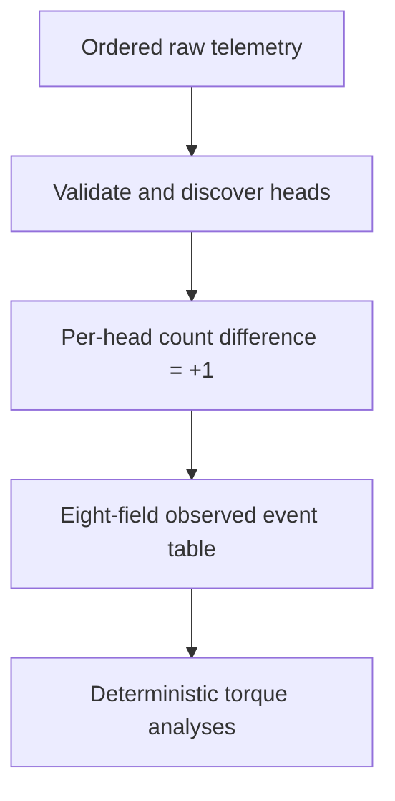

# Person A — raw telemetry, observed events and deterministic torque analytics

This is a review guide to the supplied **Person A standalone source snapshot**, with the merged project's later decisions called out below. It is a functional ownership guide, not an assertion about who typed each line after integration. Paths refer to repository-relative Python files. Names and source line numbers are from the inspected snapshot and may shift on later commits.

## What Person A built

1. Read configured wide AROL telemetry, retaining one timestamp and the `H## Count` / `H## AppTorque` / `H## Status` columns for each discovered head.
2. Validate missing data, duplicates, backwards or gapped timestamps, types, and configured torque units **without silently cleaning rows**.
3. Detect an observed closure only when the **current count minus previous count equals exactly +1**. A hold, larger jump, or decrease is not a reconstructed closure. The increment row supplies torque and status.
4. Assemble an eight-field event table (`ts`, `machine_id`, `head_id`, `torque`, `status`, `error_class`, `reject_signal`, `cap_present`), and write Parquet. Person B's adapter later adds pool/head index and observation provenance fields to the shared contract.
5. Run deterministic torque summary, histogram, trend, anomaly, and two-head correlation analyses; publish their original tool schemas and executor.

**Critical distinction:** `status == 0` indicates a successful status. `cap_present` and `reject_signal` are decoded from status; No Load is not proof of a failed cap closure. Mean torque includes a finite zero unless explicitly filtered by another rule. Naive timestamps retain their stored values; do not claim the plant timezone has been confirmed.

**Original versus merged behavior:** The later partitioned builder in `src/ingestion/event_pool.py` carries counter baselines across adjacent files in the 89-file pool and keeps only exact +1 observations. That builder was an **integration extension**, documented separately, not a claim that Person A's original `build_event_table_frame` by itself produced the full 89-file pool. Person A's original head-success comparison excludes No Load; the merged explicit KPI reports separately label a confirmed-cap denominator and the legacy A denominator.

## Public entry points and typical review path

| Stage | Entry points | Inspect next |
|---|---|---|
| Input | `load_config`, `get_pool_files`, `load_file`, `load_pool`, `scan_csv_telemetry` | `ingestion/conversion.py`, `ingestion/loader.py` |
| Quality | `validate_data` in pandas and Polars versions | Individual `check_*` functions and fixture tests |
| Observed closures | `detect_head_closures_frame`, `build_event_table_frame` | Exact +1 conditions and first-row baseline |
| Persist events | `write_event_table_parquet` | Eight output columns, types, order |
| Analyze | `torque_stats`, `torque_distribution`, `torque_trend`, `detect_torque_anomalies`, `head_correlation` | Finite torque, status filter, thresholds, shared-timestamp pairs |
| Expose tools | `list_tool_schemas`, `execute_tool` | Value validation belongs to analytics, trusted config stays outside model arguments |

## Source tests and limits

The snapshot includes: `tests/test_anomaly_detection.py`, `tests/test_capping_speed.py`, `tests/test_capping_speed_polars.py`, `tests/test_closure_detection.py`, `tests/test_closure_detection_polars.py`, `tests/test_conversion.py`, `tests/test_diagnostic_queries.py`, `tests/test_event_assembly.py`, `tests/test_event_assembly_polars.py`, `tests/test_event_table.py`, `tests/test_event_table_polars.py`, `tests/test_head_correlation.py`, `tests/test_loader.py`, `tests/test_tool_executor.py`, `tests/test_tool_interface_integration.py`, `tests/test_tool_schemas.py`, `tests/test_torque_distribution.py`, `tests/test_torque_stats.py`, `tests/test_trend_analysis.py`, `tests/test_validation.py`, `tests/test_validation_polars.py`. The project later passed a merged 852-test local run; that count refers to the **whole repository**, not Person A alone. For exact latest test counts consult the test output at the commit under review. No raw production files or generated event pool are committed to Git.

## Person A function and method reference

Functions and methods below are listed from the inspected Python source. Private helpers are included because they explain the data and validation paths. Parameter names and return annotations are taken from source; `not annotated` means the code does not declare a return type.

### `src/ingestion/loader.py`

Owns raw input only: selects configured pools, reads CSV/JSON/Parquet, preserves input order and wide telemetry fields. It does not infer events or repair data.

- **`load_config`** ([`src/ingestion/loader.py`](../src/ingestion/loader.py#L21), line 21): Read YAML and reject unreadable or structurally invalid settings before any data loading. Load config.yaml and return its contents as a Python dictionary. **Parameters:** `config_path`. **Return contract:** `not annotated`; see the implementation for structured fields and error cases.
- **`get_pool_files`** ([`src/ingestion/loader.py`](../src/ingestion/loader.py#L71), line 71): Resolve the named pool to its configured, ordered file paths; reject missing or unknown pools. Get the ordered list of telemetry files belonging to a pool. **Parameters:** `config`, `pool_name`. **Return contract:** `not annotated`; see the implementation for structured fields and error cases.
- **`load_file`** ([`src/ingestion/loader.py`](../src/ingestion/loader.py#L124), line 124): Return a raw wide frame for one CSV, JSON or Parquet file while retaining telemetry columns. Load ONE telemetry file. **Parameters:** `file_path`. **Return contract:** `not annotated`; see the implementation for structured fields and error cases.
- **`load_pool`** ([`src/ingestion/loader.py`](../src/ingestion/loader.py#L231), line 231): Read and concatenate pool files in declared order into one raw frame; adjacent files form a continuous sequence. Load ALL files belonging to one dataset pool. **Parameters:** `pool_name`, `config_path`. **Return contract:** `not annotated`; see the implementation for structured fields and error cases.
- **`scan_parquet_file`** ([`src/ingestion/loader.py`](../src/ingestion/loader.py#L361), line 361): Return a lazy scan for one stored Parquet telemetry file. **Parameters:** `file_path`. **Return contract:** `not annotated`; see the implementation for structured fields and error cases.
- **`scan_parquet_pool`** ([`src/ingestion/loader.py`](../src/ingestion/loader.py#L369), line 369): Build a lazy scan across ordered Parquet files for downstream processing. **Parameters:** `file_paths`. **Return contract:** `not annotated`; see the implementation for structured fields and error cases.

### `src/ingestion/conversion.py`

Converts raw CSV telemetry to Parquet with parsed timestamps; scanning remains lazy and the pool converter preserves the caller's file order.

- **`scan_csv_telemetry`** ([`src/ingestion/conversion.py`](../src/ingestion/conversion.py#L6), line 6): Lazily parse observed CSV timestamp formats and expose the wide telemetry columns to Polars. Lazily scan an AROL telemetry CSV and make sure the timestamp column is parsed as Datetime. **Parameters:** `csv_path`. **Return contract:** `not annotated`; see the implementation for structured fields and error cases.
- **`convert_csv_to_parquet`** ([`src/ingestion/conversion.py`](../src/ingestion/conversion.py#L56), line 56): Convert one AROL telemetry CSV file to Parquet. **Parameters:** `csv_path`, `parquet_path`. **Return contract:** `not annotated`; see the implementation for structured fields and error cases.
- **`convert_csv_pool_to_parquet`** ([`src/ingestion/conversion.py`](../src/ingestion/conversion.py#L85), line 85): Convert multiple AROL CSV files to Parquet. **Parameters:** `csv_paths`, `output_dir`. **Return contract:** `not annotated`; see the implementation for structured fields and error cases.

### `src/ingestion/validation.py`

Original pandas-style quality checks report missing data, repeated/backwards timestamps, gaps, types, and unit metadata without changing samples.

- **`check_missing_values`** ([`src/ingestion/validation.py`](../src/ingestion/validation.py#L4), line 4): Count missing values in each column. **Parameters:** `df`. **Return contract:** `not annotated`; see the implementation for structured fields and error cases.
- **`check_duplicate_timestamps`** ([`src/ingestion/validation.py`](../src/ingestion/validation.py#L30), line 30): Find timestamps that occur more than once. **Parameters:** `df`. **Return contract:** `not annotated`; see the implementation for structured fields and error cases.
- **`check_out_of_order_timestamps`** ([`src/ingestion/validation.py`](../src/ingestion/validation.py#L72), line 72): Detect rows where time moves backwards. **Parameters:** `df`. **Return contract:** `not annotated`; see the implementation for structured fields and error cases.
- **`check_timestamp_gaps`** ([`src/ingestion/validation.py`](../src/ingestion/validation.py#L135), line 135): Report each gap larger than the expected one-second sampling interval with the timestamps and gap size. Detect gaps larger than the expected 1-second sampling interval. **Parameters:** `df`. **Return contract:** `not annotated`; see the implementation for structured fields and error cases.
- **`check_dtypes`** ([`src/ingestion/validation.py`](../src/ingestion/validation.py#L204), line 204): Verify timestamp types and numeric/integer-like requirements for count and status columns. Check the expected data types of telemetry columns. **Parameters:** `df`. **Return contract:** `not annotated`; see the implementation for structured fields and error cases.
- **`check_units_metadata`** ([`src/ingestion/validation.py`](../src/ingestion/validation.py#L348), line 348): Check that expected units metadata exists in config. **Parameters:** `config`. **Return contract:** `not annotated`; see the implementation for structured fields and error cases.
- **`validate_data`** ([`src/ingestion/validation.py`](../src/ingestion/validation.py#L389), line 389): Run all quality and unit checks and return a structured diagnostic report without editing telemetry. Run all Step 5 validation checks. **Parameters:** `df`, `config`. **Return contract:** `not annotated`; see the implementation for structured fields and error cases.

### `src/ingestion/validation_polars.py`

Polars implementation of quality checks, including null/NaN and integer-like counter/status checks. Checks report evidence; they do not clean the underlying rows.

- **`_as_lazy`** ([`src/ingestion/validation_polars.py`](../src/ingestion/validation_polars.py#L4), line 4): Normalize supported Polars input to a LazyFrame. **Parameters:** `df`. **Return contract:** `not annotated`; see the implementation for structured fields and error cases.
- **`_has_datetime_timestamp`** ([`src/ingestion/validation_polars.py`](../src/ingestion/validation_polars.py#L24), line 24): Return True only when the timestamp column exists and has Polars Datetime dtype. **Parameters:** `lazy_df`. **Return contract:** `not annotated`; see the implementation for structured fields and error cases.
- **`check_missing_values`** ([`src/ingestion/validation_polars.py`](../src/ingestion/validation_polars.py#L45), line 45): Count missing values in each column. **Parameters:** `df`. **Return contract:** `not annotated`; see the implementation for structured fields and error cases.
- **`check_duplicate_timestamps`** ([`src/ingestion/validation_polars.py`](../src/ingestion/validation_polars.py#L112), line 112): Find timestamps that occur more than once. **Parameters:** `df`. **Return contract:** `not annotated`; see the implementation for structured fields and error cases.
- **`check_out_of_order_timestamps`** ([`src/ingestion/validation_polars.py`](../src/ingestion/validation_polars.py#L179), line 179): Detect rows where time moves backwards. **Parameters:** `df`. **Return contract:** `not annotated`; see the implementation for structured fields and error cases.
- **`check_timestamp_gaps`** ([`src/ingestion/validation_polars.py`](../src/ingestion/validation_polars.py#L290), line 290): Report each gap larger than the expected one-second sampling interval with the timestamps and gap size. Detect gaps larger than the expected one-second sampling interval. **Parameters:** `df`. **Return contract:** `not annotated`; see the implementation for structured fields and error cases.
- **`check_dtypes`** ([`src/ingestion/validation_polars.py`](../src/ingestion/validation_polars.py#L430), line 430): Verify timestamp types and numeric/integer-like requirements for count and status columns. Check expected telemetry data types. **Parameters:** `df`. **Return contract:** `not annotated`; see the implementation for structured fields and error cases.
- **`check_units_metadata`** ([`src/ingestion/validation_polars.py`](../src/ingestion/validation_polars.py#L704), line 704): Check that expected units metadata exists in config. **Parameters:** `config`. **Return contract:** `not annotated`; see the implementation for structured fields and error cases.
- **`validate_data`** ([`src/ingestion/validation_polars.py`](../src/ingestion/validation_polars.py#L760), line 760): Run all quality and unit checks and return a structured diagnostic report without editing telemetry. Run all Step 5 Polars validation checks. **Parameters:** `df`, `config`. **Return contract:** `not annotated`; see the implementation for structured fields and error cases.

### `src/ingestion/closure_detection.py`

Small reference implementation of the one-head counter rule, useful to explain the semantics independently of Polars.

- **`detect_head_closures`** ([`src/ingestion/closure_detection.py`](../src/ingestion/closure_detection.py#L1), line 1): Compare consecutive counter observations for one head; only a delta of exactly +1 produces an observed closure. **Parameters:** `df`, `head_id`. **Return contract:** `not annotated`; see the implementation for structured fields and error cases.

### `src/ingestion/closure_detection_polars.py`

Vectorized one-head closure detector: emit a record only when current counter minus previous counter equals exactly 1; associate torque, status and timestamp with the increment row.

- **`_as_lazy`** ([`src/ingestion/closure_detection_polars.py`](../src/ingestion/closure_detection_polars.py#L4), line 4): Normalize supported Polars input to a LazyFrame. **Parameters:** `df`. **Return contract:** `not annotated`; see the implementation for structured fields and error cases.
- **`detect_head_closures_frame`** ([`src/ingestion/closure_detection_polars.py`](../src/ingestion/closure_detection_polars.py#L24), line 24): Compute the same exact +1 rule as Polars expressions and carry the increment row's timestamp, status and torque. Detect closures for one capping head using Polars. **Parameters:** `df`, `head_id`. **Return contract:** `not annotated`; see the implementation for structured fields and error cases.
- **`detect_head_closures`** ([`src/ingestion/closure_detection_polars.py`](../src/ingestion/closure_detection_polars.py#L139), line 139): Compare consecutive counter observations for one head; only a delta of exactly +1 produces an observed closure. Compatibility wrapper around the lazy production implementation. **Parameters:** `df`, `head_id`. **Return contract:** `not annotated`; see the implementation for structured fields and error cases.

### `src/ingestion/event_assembly.py`

Reference mapping from a detected closure and machine ID into the agreed original event fields; includes status decoding.

- **`decode_status`** ([`src/ingestion/event_assembly.py`](../src/ingestion/event_assembly.py#L25), line 25): Map a raw AROL status value to a readable status/error classification; the two codebases retain their own representation. **Parameters:** `status`. **Return contract:** `not annotated`; see the implementation for structured fields and error cases.
- **`assemble_event`** ([`src/ingestion/event_assembly.py`](../src/ingestion/event_assembly.py#L42), line 42): Fill event columns for one observed closure, associating its machine and head with row-level torque and status. **Parameters:** `closure`, `machine_id`. **Return contract:** `not annotated`; see the implementation for structured fields and error cases.

### `src/ingestion/event_assembly_polars.py`

Vectorized status lookup and event assembly with scalar compatibility helpers. The fields in Person A's eight-column event table are preserved at the handoff.

- **`_as_lazy`** ([`src/ingestion/event_assembly_polars.py`](../src/ingestion/event_assembly_polars.py#L48), line 48): Normalize supported Polars input to LazyFrame. **Parameters:** `df`. **Return contract:** `not annotated`; see the implementation for structured fields and error cases.
- **`_build_status_lookup`** ([`src/ingestion/event_assembly_polars.py`](../src/ingestion/event_assembly_polars.py#L68), line 68): Build the small status-code lookup as a Polars LazyFrame. **Parameters:** none. **Return contract:** `not annotated`; see the implementation for structured fields and error cases.
- **`decode_status`** ([`src/ingestion/event_assembly_polars.py`](../src/ingestion/event_assembly_polars.py#L112), line 112): Map a raw AROL status value to a readable status/error classification; the two codebases retain their own representation. Decode one status code. **Parameters:** `status`. **Return contract:** `not annotated`; see the implementation for structured fields and error cases.
- **`assemble_event`** ([`src/ingestion/event_assembly_polars.py`](../src/ingestion/event_assembly_polars.py#L151), line 151): Fill event columns for one observed closure, associating its machine and head with row-level torque and status. Assemble one event dictionary. **Parameters:** `closure`, `machine_id`. **Return contract:** `not annotated`; see the implementation for structured fields and error cases.
- **`assemble_events_frame`** ([`src/ingestion/event_assembly_polars.py`](../src/ingestion/event_assembly_polars.py#L203), line 203): Vectorize status lookup, metadata selection and event-field assembly for many closure rows. Assemble closure rows into the agreed event schema using Polars expressions. **Parameters:** `closures`, `machine_id`. **Return contract:** `not annotated`; see the implementation for structured fields and error cases.
- **`assemble_events`** ([`src/ingestion/event_assembly_polars.py`](../src/ingestion/event_assembly_polars.py#L357), line 357): Compatibility wrapper. **Parameters:** `closures`, `machine_id`. **Return contract:** `not annotated`; see the implementation for structured fields and error cases.

### `src/ingestion/event_table.py`

Reference orchestration that discovers heads from column names and joins their detected closures into an event table.

- **`detect_head_ids`** ([`src/ingestion/event_table.py`](../src/ingestion/event_table.py#L18), line 18): Extract sorted head identifiers from the `H## Count` columns rather than assuming a fixed head count. **Parameters:** `df`. **Return contract:** `not annotated`; see the implementation for structured fields and error cases.
- **`build_event_table`** ([`src/ingestion/event_table.py`](../src/ingestion/event_table.py#L29), line 29): Materialize the preceding event-building pipeline as a Polars DataFrame or a reference list depending on module. **Parameters:** `df`, `machine_id`. **Return contract:** `not annotated`; see the implementation for structured fields and error cases.

### `src/ingestion/event_table_polars.py`

Production Polars event builder: discover heads, collect each head's exact +1 events, assemble fields, enforce schema, and optionally write Parquet.

- **`_as_lazy`** ([`src/ingestion/event_table_polars.py`](../src/ingestion/event_table_polars.py#L46), line 46): Normalize supported Polars input to LazyFrame. **Parameters:** `df`. **Return contract:** `not annotated`; see the implementation for structured fields and error cases.
- **`_empty_event_frame`** ([`src/ingestion/event_table_polars.py`](../src/ingestion/event_table_polars.py#L62), line 62): Return an empty LazyFrame with the exact final event-table schema. **Parameters:** none. **Return contract:** `not annotated`; see the implementation for structured fields and error cases.
- **`_enforce_event_schema`** ([`src/ingestion/event_table_polars.py`](../src/ingestion/event_table_polars.py#L76), line 76): Select the final event columns in the agreed order and normalize their dtypes. **Parameters:** `df`. **Return contract:** `not annotated`; see the implementation for structured fields and error cases.
- **`detect_head_ids`** ([`src/ingestion/event_table_polars.py`](../src/ingestion/event_table_polars.py#L139), line 139): Extract sorted head identifiers from the `H## Count` columns rather than assuming a fixed head count. Automatically detect capping-head IDs from columns ending in " Count". **Parameters:** `df`. **Return contract:** `not annotated`; see the implementation for structured fields and error cases.
- **`build_event_table_frame`** ([`src/ingestion/event_table_polars.py`](../src/ingestion/event_table_polars.py#L191), line 191): Detect heads, execute each head's +1 detector, concatenate observed closures and enforce final event column types. Build the final event table as a Polars LazyFrame. **Parameters:** `df`, `machine_id`. **Return contract:** `not annotated`; see the implementation for structured fields and error cases.
- **`build_event_table`** ([`src/ingestion/event_table_polars.py`](../src/ingestion/event_table_polars.py#L275), line 275): Materialize the preceding event-building pipeline as a Polars DataFrame or a reference list depending on module. Materialized compatibility wrapper. **Parameters:** `df`, `machine_id`. **Return contract:** `not annotated`; see the implementation for structured fields and error cases.
- **`write_event_table_parquet`** ([`src/ingestion/event_table_polars.py`](../src/ingestion/event_table_polars.py#L299), line 299): Persist the normalized eight-field Person A event table for later consumption. Persist the final event table to Parquet. **Parameters:** `events`, `parquet_path`. **Return contract:** `not annotated`; see the implementation for structured fields and error cases.

### `src/analytics/capping_speed.py`

Scalar reference arithmetic for observations per interval and their incremental average; separate from the final observed-throughput reporting semantics.

- **`incremental_average`** ([`src/analytics/capping_speed.py`](../src/analytics/capping_speed.py#L1), line 1): Update a running mean with one new observation and its new sample count. **Parameters:** `current_mean`, `new_value`, `n`. **Return contract:** `not annotated`; see the implementation for structured fields and error cases.
- **`closures_to_pieces_per_hour`** ([`src/analytics/capping_speed.py`](../src/analytics/capping_speed.py#L4), line 4): Convert observed closures in a positive-duration interval to the equivalent hourly rate. **Parameters:** `closures`, `interval_seconds`. **Return contract:** `not annotated`; see the implementation for structured fields and error cases.
- **`running_capping_speed`** ([`src/analytics/capping_speed.py`](../src/analytics/capping_speed.py#L11), line 11): Compute running average closure rates across successive input intervals. **Parameters:** `closures_per_interval`, `interval_seconds`. **Return contract:** `not annotated`; see the implementation for structured fields and error cases.

### `src/analytics/capping_speed_polars.py`

Polars/vectorized equivalent of running capping speed, with input validation and original API compatibility.

- **`_as_lazy`** ([`src/analytics/capping_speed_polars.py`](../src/analytics/capping_speed_polars.py#L8), line 8): Normalize supported Polars input to LazyFrame. **Parameters:** `df`. **Return contract:** `not annotated`; see the implementation for structured fields and error cases.
- **`incremental_average`** ([`src/analytics/capping_speed_polars.py`](../src/analytics/capping_speed_polars.py#L28), line 28): Update a running mean with one new observation and its new sample count. Update a running arithmetic mean. **Parameters:** `current_mean`, `new_value`, `n`. **Return contract:** `not annotated`; see the implementation for structured fields and error cases.
- **`closures_to_pieces_per_hour`** ([`src/analytics/capping_speed_polars.py`](../src/analytics/capping_speed_polars.py#L56), line 56): Convert observed closures in a positive-duration interval to the equivalent hourly rate. Convert the number of closures observed in an interval into pieces per hour. **Parameters:** `closures`, `interval_seconds`. **Return contract:** `not annotated`; see the implementation for structured fields and error cases.
- **`running_capping_speed_frame`** ([`src/analytics/capping_speed_polars.py`](../src/analytics/capping_speed_polars.py#L88), line 88): Calculate instantaneous and running capping speed using Polars expressions. **Parameters:** `df`, `interval_seconds`, `closures_col`. **Return contract:** `not annotated`; see the implementation for structured fields and error cases.
- **`running_capping_speed`** ([`src/analytics/capping_speed_polars.py`](../src/analytics/capping_speed_polars.py#L215), line 215): Compute running average closure rates across successive input intervals. Compatibility wrapper preserving the original API. **Parameters:** `closures_per_interval`, `interval_seconds`. **Return contract:** `not annotated`; see the implementation for structured fields and error cases.

### `src/analytics/torque_stats.py`

Deterministic finite-torque summary, optionally filtered by raw status or successful status 0. Zero is finite and remains in the sample.

- **`_as_lazy`** ([`src/analytics/torque_stats.py`](../src/analytics/torque_stats.py#L7), line 7): Normalize a Polars DataFrame or LazyFrame to LazyFrame. **Parameters:** `events`. **Return contract:** `pl.LazyFrame`; see the implementation for structured fields and error cases.
- **`_validate_event_schema`** ([`src/analytics/torque_stats.py`](../src/analytics/torque_stats.py#L25), line 25): Verify that the columns required for torque statistics exist. **Parameters:** `events`. **Return contract:** `None`; see the implementation for structured fields and error cases.
- **`_apply_status_filter`** ([`src/analytics/torque_stats.py`](../src/analytics/torque_stats.py#L51), line 51): Apply the optional event-status filter. **Parameters:** `events`, `status_filter`. **Return contract:** `pl.LazyFrame`; see the implementation for structured fields and error cases.
- **`torque_stats`** ([`src/analytics/torque_stats.py`](../src/analytics/torque_stats.py#L111), line 111): Filter eligible events, keep finite torque (including 0), then compute count, mean, min, max and sample standard deviation. Calculate deterministic torque statistics over the clean event table. **Parameters:** `events`, `status_filter`. **Return contract:** `dict`; see the implementation for structured fields and error cases.
- **`torque_stats.<locals>.plain_float`** ([`src/analytics/torque_stats.py`](../src/analytics/torque_stats.py#L209), line 209): Convert an engine/numeric scalar into a plain Python float for JSON-safe result fields. **Parameters:** `value`. **Return contract:** `not annotated`; see the implementation for structured fields and error cases.

### `src/analytics/torque_distribution.py`

Equal-width torque histogram with explicit bin-edge rules and the final right edge included.

- **`_validate_bins`** ([`src/analytics/torque_distribution.py`](../src/analytics/torque_distribution.py#L10), line 10): Validate the requested number of histogram bins. **Parameters:** `bins`. **Return contract:** `not annotated`; see the implementation for structured fields and error cases.
- **`_prepare_torque_events`** ([`src/analytics/torque_distribution.py`](../src/analytics/torque_distribution.py#L31), line 31): Prepare valid torque observations from the clean event table. **Parameters:** `events`, `status_filter`. **Return contract:** `pl.LazyFrame`; see the implementation for structured fields and error cases.
- **`_build_bin_edges`** ([`src/analytics/torque_distribution.py`](../src/analytics/torque_distribution.py#L61), line 61): Build equal-width histogram bin edges. **Parameters:** `minimum`, `maximum`, `bins`. **Return contract:** `list[float]`; see the implementation for structured fields and error cases.
- **`_count_histogram_bins`** ([`src/analytics/torque_distribution.py`](../src/analytics/torque_distribution.py#L99), line 99): Count torque observations in each histogram bin. **Parameters:** `events`, `bin_edges`. **Return contract:** `list[int]`; see the implementation for structured fields and error cases.
- **`torque_distribution`** ([`src/analytics/torque_distribution.py`](../src/analytics/torque_distribution.py#L164), line 164): Build equal-width histogram edges and assign each finite torque once; include the rightmost edge only in the last bin. Calculate the torque histogram for the clean event table. **Parameters:** `events`, `bins`, `status_filter`. **Return contract:** `dict`; see the implementation for structured fields and error cases.

### `src/analytics/trend_analysis.py`

Chronological torque moving average and configured recent-window slope/drift classification.

- **`_validate_trend_schema`** ([`src/analytics/trend_analysis.py`](../src/analytics/trend_analysis.py#L15), line 15): Validate the columns required for trend analysis. **Parameters:** `events`. **Return contract:** `None`; see the implementation for structured fields and error cases.
- **`_get_drift_window_seconds`** ([`src/analytics/trend_analysis.py`](../src/analytics/trend_analysis.py#L50), line 50): Read and validate the configured drift window. **Parameters:** `config`. **Return contract:** `int`; see the implementation for structured fields and error cases.
- **`_prepare_trend_events`** ([`src/analytics/trend_analysis.py`](../src/analytics/trend_analysis.py#L99), line 99): Prepare valid event-level torque observations. **Parameters:** `events`, `status_filter`. **Return contract:** `pl.LazyFrame`; see the implementation for structured fields and error cases.
- **`_calculate_drift_slope`** ([`src/analytics/trend_analysis.py`](../src/analytics/trend_analysis.py#L140), line 140): Calculate the linear slope of the moving average inside the most recent configured time window. **Parameters:** `trend_frame`, `window_seconds`. **Return contract:** `float | None`; see the implementation for structured fields and error cases.
- **`_classify_drift`** ([`src/analytics/trend_analysis.py`](../src/analytics/trend_analysis.py#L269), line 269): Convert the numerical trend slope into an interpretable drift signal. **Parameters:** `slope`. **Return contract:** `tuple[bool, str]`; see the implementation for structured fields and error cases.
- **`torque_trend`** ([`src/analytics/trend_analysis.py`](../src/analytics/trend_analysis.py#L304), line 304): Sort finite-torque events by timestamp, compute recent moving averages, fit a slope and classify drift. Calculate a time-based moving average and drift signal from the clean event table. **Parameters:** `events`, `config`, `status_filter`. **Return contract:** `dict`; see the implementation for structured fields and error cases.

### `src/analytics/anomaly_detection.py`

Torque flags from configured physical bounds and statistical deviations. Flags are descriptive and do not identify physical causes.

- **`_validate_anomaly_schema`** ([`src/analytics/anomaly_detection.py`](../src/analytics/anomaly_detection.py#L11), line 11): Validate the clean event-table columns required by anomaly detection. **Parameters:** `events`. **Return contract:** `None`; see the implementation for structured fields and error cases.
- **`_get_anomaly_config`** ([`src/analytics/anomaly_detection.py`](../src/analytics/anomaly_detection.py#L52), line 52): Read and validate anomaly configuration. **Parameters:** `config`. **Return contract:** `tuple[float, float, float]`; see the implementation for structured fields and error cases.
- **`_prepare_anomaly_events`** ([`src/analytics/anomaly_detection.py`](../src/analytics/anomaly_detection.py#L167), line 167): Prepare valid event-level torque observations. **Parameters:** `events`, `status_filter`. **Return contract:** `pl.LazyFrame`; see the implementation for structured fields and error cases.
- **`detect_torque_anomalies`** ([`src/analytics/anomaly_detection.py`](../src/analytics/anomaly_detection.py#L207), line 207): Flag observations outside configured torque bounds and/or the specified standard-deviation threshold. Detect torque anomalies using two deterministic mechanisms: **Parameters:** `events`, `config`, `status_filter`. **Return contract:** `dict`; see the implementation for structured fields and error cases.

### `src/analytics/head_correlation.py`

Two-head descriptive comparison: per-head summaries, matched-timestamp torque pairs, Pearson correlation where defined, and success-rate differences.

- **`_validate_head_correlation_schema`** ([`src/analytics/head_correlation.py`](../src/analytics/head_correlation.py#L15), line 15): Validate the columns required for head-to-head comparison. **Parameters:** `events`. **Return contract:** `None`; see the implementation for structured fields and error cases.
- **`_validate_head_ids`** ([`src/analytics/head_correlation.py`](../src/analytics/head_correlation.py#L59), line 59): Validate requested head identifiers. **Parameters:** `head_a`, `head_b`. **Return contract:** `None`; see the implementation for structured fields and error cases.
- **`_finite_torque_rows`** ([`src/analytics/head_correlation.py`](../src/analytics/head_correlation.py#L99), line 99): Keep only valid finite torque observations. **Parameters:** `events`. **Return contract:** `pl.DataFrame`; see the implementation for structured fields and error cases.
- **`_head_summary`** ([`src/analytics/head_correlation.py`](../src/analytics/head_correlation.py#L114), line 114): Calculate independent summary information for one head. **Parameters:** `events`, `head_id`. **Return contract:** `dict`; see the implementation for structured fields and error cases.
- **`_matched_torque_pairs`** ([`src/analytics/head_correlation.py`](../src/analytics/head_correlation.py#L217), line 217): Pair torque observations from two heads using the same event timestamp. **Parameters:** `events`, `head_a`, `head_b`. **Return contract:** `pl.DataFrame`; see the implementation for structured fields and error cases.
- **`_calculate_torque_correlation`** ([`src/analytics/head_correlation.py`](../src/analytics/head_correlation.py#L282), line 282): Calculate Pearson torque correlation over timestamps shared by both heads. **Parameters:** `matched`. **Return contract:** `float | None`; see the implementation for structured fields and error cases.
- **`_interpret_correlation`** ([`src/analytics/head_correlation.py`](../src/analytics/head_correlation.py#L341), line 341): Convert the numerical Pearson correlation into a deterministic interpretable category. **Parameters:** `correlation`, `matched_count`. **Return contract:** `str`; see the implementation for structured fields and error cases.
- **`_success_rate_comparison`** ([`src/analytics/head_correlation.py`](../src/analytics/head_correlation.py#L406), line 406): Compare success rates. **Parameters:** `rate_a`, `rate_b`. **Return contract:** `tuple[float | None, float | None, str]`; see the implementation for structured fields and error cases.
- **`head_correlation`** ([`src/analytics/head_correlation.py`](../src/analytics/head_correlation.py#L465), line 465): Summarize two heads and compute Pearson correlation only for finite torque pairs at shared timestamps. Compare the behavior of two capping heads. **Parameters:** `events`, `head_a`, `head_b`. **Return contract:** `dict`; see the implementation for structured fields and error cases.

### `src/agent/tool_schemas.py`

Canonical definitions for Person A's five analytics tools; parameter names are constrained and runtime data/config are not model-visible tool arguments.

- **`_status_filter_schema`** ([`src/agent/tool_schemas.py`](../src/agent/tool_schemas.py#L7), line 7): JSON-schema fragment shared by analytics tools that support optional event-status filtering. **Parameters:** none. **Return contract:** `dict`; see the implementation for structured fields and error cases.
- **`list_tool_schemas`** ([`src/agent/tool_schemas.py`](../src/agent/tool_schemas.py#L192), line 192): Return defensive copies of all registered tool schemas. **Parameters:** none. **Return contract:** `list[dict]`; see the implementation for structured fields and error cases.
- **`get_tool_schema`** ([`src/agent/tool_schemas.py`](../src/agent/tool_schemas.py#L208), line 208): Return one registered tool schema by name. **Parameters:** `tool_name`. **Return contract:** `dict`; see the implementation for structured fields and error cases.

### `src/agent/tool_executor.py`

Original deterministic tool-call dispatcher, checking tool name and argument keys before invoking the corresponding Person A analytics function.

- **`_normalize_arguments`** ([`src/agent/tool_executor.py`](../src/agent/tool_executor.py#L28), line 28): Normalize tool-call arguments. **Parameters:** `arguments`. **Return contract:** `dict`; see the implementation for structured fields and error cases.
- **`_validate_argument_keys`** ([`src/agent/tool_executor.py`](../src/agent/tool_executor.py#L55), line 55): Validate required and additional argument names against the canonical Step 15 schema. **Parameters:** `tool_name`, `arguments`. **Return contract:** `None`; see the implementation for structured fields and error cases.
- **`_execute_torque_stats`** ([`src/agent/tool_executor.py`](../src/agent/tool_executor.py#L128), line 128): Execute torque summary statistics. **Parameters:** `events`, `config`, `arguments`. **Return contract:** `not annotated`; see the implementation for structured fields and error cases.
- **`_execute_torque_distribution`** ([`src/agent/tool_executor.py`](../src/agent/tool_executor.py#L145), line 145): Execute torque histogram generation. **Parameters:** `events`, `config`, `arguments`. **Return contract:** `not annotated`; see the implementation for structured fields and error cases.
- **`_execute_torque_trend`** ([`src/agent/tool_executor.py`](../src/agent/tool_executor.py#L166), line 166): Execute timestamp-based torque trend analysis. **Parameters:** `events`, `config`, `arguments`. **Return contract:** `not annotated`; see the implementation for structured fields and error cases.
- **`_execute_torque_anomalies`** ([`src/agent/tool_executor.py`](../src/agent/tool_executor.py#L187), line 187): Execute deterministic torque-anomaly detection. **Parameters:** `events`, `config`, `arguments`. **Return contract:** `not annotated`; see the implementation for structured fields and error cases.
- **`_execute_head_correlation`** ([`src/agent/tool_executor.py`](../src/agent/tool_executor.py#L208), line 208): Execute deterministic head-to-head comparison. **Parameters:** `events`, `config`, `arguments`. **Return contract:** `not annotated`; see the implementation for structured fields and error cases.
- **`execute_tool`** ([`src/agent/tool_executor.py`](../src/agent/tool_executor.py#L247), line 247): Execute one registered deterministic analytics tool. **Parameters:** `tool_name`, `arguments`, `events`, `config`. **Return contract:** `dict`; see the implementation for structured fields and error cases.

### `src/agent/diagnostic_queries.py`

Versioned example questions for exercising tool selection and combinations; a catalogue, not a natural-language accuracy guarantee.

- **`list_diagnostic_query_cases`** ([`src/agent/diagnostic_queries.py`](../src/agent/diagnostic_queries.py#L133), line 133): Return defensive copies of the diagnostic query suite. **Parameters:** none. **Return contract:** `not annotated`; see the implementation for structured fields and error cases.

## Questions to use when reviewing Person A's implementation

1. **Why exact +1?** Point to `detect_head_closures_frame`: it compares consecutive observations on one head and emits an event only when the difference is one. A +10 jump shows ten counter units but does not reveal ten timestamps, torques or statuses. A decrease can indicate several mechanisms, so the pipeline does not label it as a reset without independent evidence.
2. **Which reading belongs to the event?** The status and torque come from the row where the increment becomes visible. The preceding row is only the comparison baseline.
3. **What is validated?** Compare `validate_data` with `build_event_table_frame`. The validator diagnoses missing/duplicate/out-of-order/gapped timestamps, dtypes and configured units; event assembly is a separate stage. A validation report must not be described as automatic correction.
4. **What is the basis for statistics?** Trace `torque_stats` and `torque_distribution` back to finite selected torque observations. A finite 0 remains in the sample; null, NaN and infinity are excluded. Do not equate a mean or histogram flag with an engineering pass/fail threshold.
5. **Why match head timestamps?** `head_correlation` forms same-timestamp pairs before Pearson calculation. It must not correlate the 1st event of H05 with the 1st event of H06 when they happened at different times. A correlation does not identify a cause.
6. **What belongs to trusted configuration?** Anomaly bounds, sigma and trend window are read by deterministic functions from configuration; they are not values a language model should supply as unchecked tool arguments.

**Known data-quality boundary:** CSV files have 1-second nominal sample spacing, yet measured gaps and counter jumps exist. The separate full-pool audit recorded 408,076 positive-jump rows and 2,088 decreases across 89 files and all heads. A counter unit is not evidence of one reconstructed closure event when the observation jumped.
