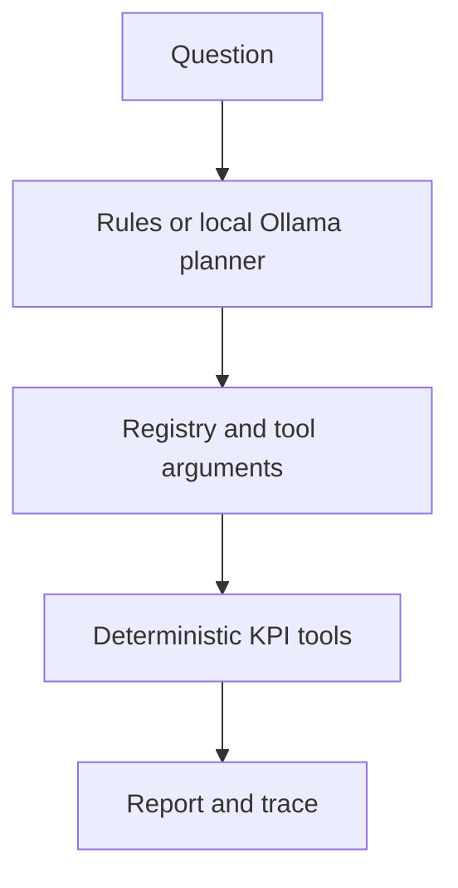

# Person B — agent infrastructure, KPI tools, contract and presentation layer

This guide documents the **Person B standalone source snapshot** supplied in the project, then distinguishes behaviors changed by the merged integration. Paths and line numbers refer to that snapshot; do not assume a standalone implementation is identical to current `main`.

## What Person B built

1. A canonical twelve-column event contract and bitfield-aware status decoding. `cap_present` can be true, false, **or unknown**, so an unknown cannot silently become a success-rate denominator.
2. A data-source boundary, adapter for Person A's eight-column Parquet events, synthetic event generator with planted ground truth, and an explicit real-source API stub.
3. KPI and diagnostic tools for overall/per-head success and rejection, anomaly heads, idle intervals, throughput, and head detail. These tools compute values in Python/Polars; the model chooses tools and does not calculate rates.
4. Registry, typed parameter vocabulary, JSON-safe success/failure envelopes, trace records, rule-based and local Ollama planners, six-section Markdown reports, CLI, optional plots and HTML/PDF export.
5. A benchmark comparing a simple monolithic baseline with a columnar/agent pipeline, plus tests for contract, adapter, agent and planted-fault detection.

**Important historical caveats:** Person B's standalone `Orchestrator._retry` could progressively drop filters when a tool failed. The merged agent **does not relax a requested head, machine, status or time bound**. The standalone raw `RealSource` depends on a stub API; the final real-data path uses a validated Person A event Parquet or a partitioned event pool. The standalone success-rate formulas and throughputs are useful to understand Person B's original work but **must not be presented as identical** to the later explicit-cap KPI definitions or final observed-throughput reports.

## Standalone interfaces

| Concern | Main files | Practical meaning |
|---|---|---|
| Contract | `common/schema.py`, `ingestion/adapter.py` | Validate and supplement Person A's event fields while disclosing uncertain semantics |
| Data | `common/datasource.py`, `testing/synth.py` | Synthetic ground truth or supplied Person A Parquet; original raw-real path is a stub |
| Tool layer | `common/registry.py`, `common/envelope.py`, `analytics/kpi.py` | Typed registered functions return explicit counts, rates, metadata and failures |
| Agent loop | `agent/planner.py`, `agent/orchestrator.py`, `agent/trace.py` | Choose calls, run deterministic tools, record what happened |
| Presentation | `agent/report.py`, `interface/cli.py`, `interface/export.py`, `interface/plots.py` | Text report, optional charts and export |
| Validation | `testing/benchmark.py`, standalone `tests/` | Controlled faults and performance comparisons |

## Test inventory

The standalone checkout contains `tests/test_adapter.py`, `tests/test_agent.py`, `tests/test_benchmark.py`, `tests/test_cli.py`, `tests/test_contract.py`, `tests/test_datasource.py`, `tests/test_evaluation.py`, `tests/test_export.py`, `tests/test_kpi.py`, `tests/test_llm_planner.py`, `tests/test_timeutils.py`. Some standalone integration/benchmark tests depend on a nearby Person A checkout or private telemetry and can skip; the earlier standalone run reported **254 passed, 3 skipped** after a missing Ollama model was pulled. The final merged project's 852 tests and 28 controlled evaluation cases cover a later implementation.

## Person B function and method reference

Functions and methods below are listed from the inspected Python source. Private helpers are included because they explain the data and validation paths. Parameter names and return annotations are taken from source; `not annotated` means the code does not declare a return type.

### `src/common/schema.py`

Shared twelve-column contract, status bitfield decoder, empty event constructor, and schema conformance checks. Contract metadata includes nullable cap presence.

- **`_category`** (`src/common/schema.py`, line 116): Clear bit 0 to get the error category. Avoids bitwise-and on a signed dtype, which is easy to get subtly wrong. **Parameters:** `expr`. **Return contract:** `pl.Expr`; see the implementation for structured fields and error cases.
- **`decode_status`** (`src/common/schema.py`, line 122): Map a raw AROL status value to a readable status/error classification; the two codebases retain their own representation. Decode one raw status code into its contract fields. **Parameters:** `status`. **Return contract:** `dict`; see the implementation for structured fields and error cases.
- **`decode_status_series`** (`src/common/schema.py`, line 147): Vectorised decode_status. **Parameters:** `status`. **Return contract:** `pl.DataFrame`; see the implementation for structured fields and error cases.
- **`empty_events`** (`src/common/schema.py`, line 178): An empty event table with exactly the right columns and dtypes. **Parameters:** none. **Return contract:** `pl.DataFrame`; see the implementation for structured fields and error cases.
- **`validate_events`** (`src/common/schema.py`, line 187): Check a frame against the contract. Returns a list of problems. **Parameters:** `events`, `strict`. **Return contract:** `list[str]`; see the implementation for structured fields and error cases.
- **`conform`** (`src/common/schema.py`, line 225): Coerce a frame to the contract: column order and dtypes. **Parameters:** `events`. **Return contract:** `pl.DataFrame`; see the implementation for structured fields and error cases.

### `src/common/config.py`

Loads YAML configuration and merges optional local overrides; centralizes settings and paths.

- **`_deep_merge`** (`src/common/config.py`, line 24): Recursively overlay local configuration keys without losing unrelated base settings. **Parameters:** `base`, `override`. **Return contract:** `dict`; see the implementation for structured fields and error cases.
- **`load`** (`src/common/config.py`, line 34): Load config.yaml, merge config.local.yaml over it, resolve paths. **Parameters:** `path`. **Return contract:** `dict`; see the implementation for structured fields and error cases.
- **`get`** (`src/common/config.py`, line 57): Look up a registered tool or retrieve a nested config value, depending on the module. cfg lookup by dotted path: get(cfg, 'analytics.anomaly_sigma'). **Parameters:** `cfg`, `dotted`, `default`. **Return contract:** `not annotated`; see the implementation for structured fields and error cases.

### `src/common/envelope.py`

Stable JSON-safe response envelope, contributing data window, typed failure envelope, and tool timer.

- **`jsonable`** (`src/common/envelope.py`, line 25): Cast Polars / numeric scalars to plain Python so json.dumps cannot fail. **Parameters:** `value`. **Return contract:** `Any`; see the implementation for structured fields and error cases.
- **`data_window`** (`src/common/envelope.py`, line 60): ts_min / ts_max of the rows a result was computed from. **Parameters:** `events`. **Return contract:** `dict`; see the implementation for structured fields and error cases.
- **`envelope`** (`src/common/envelope.py`, line 70): Build the canonical envelope. Always four keys, always JSON-safe. **Parameters:** `result`, `n`, `tool`, `params`, `filters_applied`, `notes`, `units`, `window`, `elapsed_ms`, `error`. **Return contract:** `dict`; see the implementation for structured fields and error cases.
- **`failure`** (`src/common/envelope.py`, line 105): A tool that cannot produce a result RETURNS this - it does not raise. **Parameters:** `error`, `tool`, `params`, `n`, `notes`. **Return contract:** `dict`; see the implementation for structured fields and error cases.
- **`Timer.__enter__`** (`src/common/envelope.py`, line 118): Start the timer and return the timing context to the `with` block. **Parameters:** none. **Return contract:** `not annotated`; see the implementation for structured fields and error cases.
- **`Timer.__exit__`** (`src/common/envelope.py`, line 122): Stop the timer when the `with` block finishes, even if it raised. **Parameters:** `*exc`. **Return contract:** `not annotated`; see the implementation for structured fields and error cases.

### `src/common/registry.py`

Registers named deterministic tools, advertises JSON schemas, validates/coerces arguments, and wraps runtime calls in envelopes.

- **`ToolSpec.__init__`** (`src/common/registry.py`, line 67): Initialize this component with its required configuration and dependencies; constructor does not compute a user-facing result. **Parameters:** `fn`, `name`, `description`, `params`, `agent`, `owner`, `required`. **Return contract:** `not annotated`; see the implementation for structured fields and error cases.
- **`ToolSpec.json_schema`** (`src/common/registry.py`, line 78): The tool definition handed to an LLM for function calling. **Parameters:** none. **Return contract:** `dict`; see the implementation for structured fields and error cases.
- **`tool`** (`src/common/registry.py`, line 92): Register an analysis function as an agent-callable tool. **Parameters:** `name`, `description`, `params`, `agent`, `owner`, `required`. **Return contract:** `not annotated`; see the implementation for structured fields and error cases.
- **`tool.<locals>.decorate`** (`src/common/registry.py`, line 100): Attach the declared tool metadata and register the wrapped function under its canonical name. **Parameters:** `fn`. **Return contract:** `Callable`; see the implementation for structured fields and error cases.
- **`normalise_params`** (`src/common/registry.py`, line 118): Map aliases onto canonical names. Returns (params, renames_applied). **Parameters:** `params`. **Return contract:** `tuple[dict, list[str]]`; see the implementation for structured fields and error cases.
- **`_coerce_one`** (`src/common/registry.py`, line 143): Coerce one value to its declared JSON-Schema type. **Parameters:** `key`, `value`, `declared`. **Return contract:** `not annotated`; see the implementation for structured fields and error cases.
- **`coerce_params`** (`src/common/registry.py`, line 199): Enforce the types the tool schemas advertise to the planner. **Parameters:** `params`. **Return contract:** `tuple[dict, list[str], list[str]]`; see the implementation for structured fields and error cases.
- **`get_tool_specs`** (`src/common/registry.py`, line 233): Tool definitions for the planner, optionally filtered to one agent. **Parameters:** `agent`. **Return contract:** `list[dict]`; see the implementation for structured fields and error cases.
- **`list_tools`** (`src/common/registry.py`, line 239): Return names of registered tools available for inspection or planning. **Parameters:** none. **Return contract:** `list[str]`; see the implementation for structured fields and error cases.
- **`get`** (`src/common/registry.py`, line 243): Look up a registered tool or retrieve a nested config value, depending on the module. **Parameters:** `name`. **Return contract:** `not annotated`; see the implementation for structured fields and error cases.
- **`call_tool`** (`src/common/registry.py`, line 247): Call a registered deterministic function and return a JSON-safe success/failure envelope instead of propagating tool errors. Invoke a registered tool and guarantee a well-formed envelope. **Parameters:** `name`, `events`, `**params`. **Return contract:** `dict`; see the implementation for structured fields and error cases.

### `src/common/timeutils.py`

Parses explicit timestamp bounds and assigns calendar/shift buckets for KPI aggregation.

- **`_as_series`** (`src/common/timeutils.py`, line 33): Evaluate an expression-returning helper against a Series. **Parameters:** `expr_fn`, `ts`. **Return contract:** `not annotated`; see the implementation for structured fields and error cases.
- **`floor_to`** (`src/common/timeutils.py`, line 53): Floor a timestamp series or expression to the start of its bucket. **Parameters:** `ts`, `bucket`. **Return contract:** `not annotated`; see the implementation for structured fields and error cases.
- **`shift_name`** (`src/common/timeutils.py`, line 87): Name of the shift each timestamp falls in ("A"/"B"/"C"). **Parameters:** `ts`. **Return contract:** `not annotated`; see the implementation for structured fields and error cases.
- **`parse_bound`** (`src/common/timeutils.py`, line 100): Parse a `start`/`end` parameter. Returns None for None/empty. **Parameters:** `value`. **Return contract:** `datetime | None`; see the implementation for structured fields and error cases.

### `src/common/datasource.py`

Standalone Person B data-source interface, synthetic-source generator, Person A Parquet adapter, and a real-source stub. The merged project's data sources differ.

- **`DataSource.list_pools`** (`src/common/datasource.py`, line 21): Return configured pool names for this source, without loading event frames. **Parameters:** none. **Return contract:** `list[str]`; see the implementation for structured fields and error cases.
- **`DataSource.load_pool`** (`src/common/datasource.py`, line 24): Read and concatenate pool files in declared order into one raw frame; adjacent files form a continuous sequence. **Parameters:** `pool`. **Return contract:** `not annotated`; see the implementation for structured fields and error cases.
- **`DataSource.pool_meta`** (`src/common/datasource.py`, line 27): Describe the pool size, head/machine population, window and limitations for reports. **Parameters:** `pool`. **Return contract:** `dict`; see the implementation for structured fields and error cases.
- **`SyntheticSource.__init__`** (`src/common/datasource.py`, line 36): Initialize this component with its required configuration and dependencies; constructor does not compute a user-facing result. **Parameters:** `cfg`. **Return contract:** `not annotated`; see the implementation for structured fields and error cases.
- **`SyntheticSource.list_pools`** (`src/common/datasource.py`, line 40): Return configured pool names for this source, without loading event frames. **Parameters:** none. **Return contract:** `list[str]`; see the implementation for structured fields and error cases.
- **`SyntheticSource._get`** (`src/common/datasource.py`, line 43): Resolve or lazily initialize a configured pool for this source; reject unknown names. **Parameters:** `pool`. **Return contract:** `not annotated`; see the implementation for structured fields and error cases.
- **`SyntheticSource.load_pool`** (`src/common/datasource.py`, line 49): Read and concatenate pool files in declared order into one raw frame; adjacent files form a continuous sequence. **Parameters:** `pool`. **Return contract:** `not annotated`; see the implementation for structured fields and error cases.
- **`SyntheticSource.ground_truth`** (`src/common/datasource.py`, line 52): Only the synthetic source has this. The evaluation harness uses it. **Parameters:** `pool`. **Return contract:** `dict`; see the implementation for structured fields and error cases.
- **`SyntheticSource.pool_meta`** (`src/common/datasource.py`, line 56): Describe the pool size, head/machine population, window and limitations for reports. **Parameters:** `pool`. **Return contract:** `dict`; see the implementation for structured fields and error cases.
- **`RealSource.__init__`** (`src/common/datasource.py`, line 82): Initialize this component with its required configuration and dependencies; constructor does not compute a user-facing result. **Parameters:** `cfg`. **Return contract:** `not annotated`; see the implementation for structured fields and error cases.
- **`RealSource.list_pools`** (`src/common/datasource.py`, line 85): Return configured pool names for this source, without loading event frames. **Parameters:** none. **Return contract:** `list[str]`; see the implementation for structured fields and error cases.
- **`RealSource.load_pool`** (`src/common/datasource.py`, line 89): Read and concatenate pool files in declared order into one raw frame; adjacent files form a continuous sequence. **Parameters:** `pool`. **Return contract:** `not annotated`; see the implementation for structured fields and error cases.
- **`RealSource.pool_meta`** (`src/common/datasource.py`, line 97): Describe the pool size, head/machine population, window and limitations for reports. **Parameters:** `pool`. **Return contract:** `dict`; see the implementation for structured fields and error cases.
- **`PersonASource.__init__`** (`src/common/datasource.py`, line 125): Initialize this component with its required configuration and dependencies; constructor does not compute a user-facing result. **Parameters:** `cfg`. **Return contract:** `not annotated`; see the implementation for structured fields and error cases.
- **`PersonASource._paths`** (`src/common/datasource.py`, line 129): Return configured pool-to-event-file paths for the Person A data source. **Parameters:** none. **Return contract:** `dict[str, str]`; see the implementation for structured fields and error cases.
- **`PersonASource.list_pools`** (`src/common/datasource.py`, line 132): Return configured pool names for this source, without loading event frames. **Parameters:** none. **Return contract:** `list[str]`; see the implementation for structured fields and error cases.
- **`PersonASource._get`** (`src/common/datasource.py`, line 136): Resolve configured single-file Parquet path, load once and adapt events without altering A's decoded fields. **Parameters:** `pool`. **Return contract:** `not annotated`; see the implementation for structured fields and error cases.
- **`PersonASource.load_pool`** (`src/common/datasource.py`, line 156): Read and concatenate pool files in declared order into one raw frame; adjacent files form a continuous sequence. **Parameters:** `pool`. **Return contract:** `not annotated`; see the implementation for structured fields and error cases.
- **`PersonASource.pool_meta`** (`src/common/datasource.py`, line 159): Describe the pool size, head/machine population, window and limitations for reports. **Parameters:** `pool`. **Return contract:** `dict`; see the implementation for structured fields and error cases.
- **`get_source`** (`src/common/datasource.py`, line 168): Select the data-source implementation named in configuration. **Parameters:** `cfg`. **Return contract:** `DataSource`; see the implementation for structured fields and error cases.

### `src/analytics/kpi.py`

Standalone Person B KPI implementations: counting success/rejection, per-head rates, anomaly heads, idle periods, throughput, and head detail.

- **`_apply_filters`** (`src/analytics/kpi.py`, line 40): The one place filters are applied, so every tool filters identically. **Parameters:** `events`, `start`, `end`, `head_id`, `machine_id`, `cap_present_only`. **Return contract:** `not annotated`; see the implementation for structured fields and error cases.
- **`_confidence_note`** (`src/analytics/kpi.py`, line 71): The honest caveat. meta.n drives it - never prose. **Parameters:** `n`, `min_n`. **Return contract:** `not annotated`; see the implementation for structured fields and error cases.
- **`_finish_rates`** (`src/analytics/kpi.py`, line 97): Turn the raw counts into the rate block, with both denominators. **Parameters:** `row`. **Return contract:** `dict`; see the implementation for structured fields and error cases.
- **`_rates`** (`src/analytics/kpi.py`, line 123): The KPI block computed on one group of events. **Parameters:** `frame`. **Return contract:** `dict`; see the implementation for structured fields and error cases.
- **`success_rate`** (`src/analytics/kpi.py`, line 141): Summarize success, reject, No Load and cap-presence counts and rates for the selected population. **Parameters:** `events`, `start`, `end`, `head_id`, `machine_id`, `bucket`, `min_n`. **Return contract:** `not annotated`; see the implementation for structured fields and error cases.
- **`success_rate_per_head`** (`src/analytics/kpi.py`, line 177): Group the same KPI calculations by machine and head, exposing each group's denominator. **Parameters:** `events`, `start`, `end`, `machine_id`, `min_n`. **Return contract:** `not annotated`; see the implementation for structured fields and error cases.
- **`anomaly_heads`** (`src/analytics/kpi.py`, line 217): Find heads with unusual torque/reject behavior subject to the configured minimum sample size. **Parameters:** `events`, `start`, `end`, `machine_id`, `sigma`, `min_n`. **Return contract:** `not annotated`; see the implementation for structured fields and error cases.
- **`idle_periods`** (`src/analytics/kpi.py`, line 296): Identify consecutive No Load/idle stretches by head; thresholding follows Person B's standalone config. **Parameters:** `events`, `start`, `end`, `head_id`, `window_seconds`, `min_n`. **Return contract:** `not annotated`; see the implementation for structured fields and error cases.
- **`throughput`** (`src/analytics/kpi.py`, line 356): Aggregate observed event counts in calendar buckets and normalize by interval duration. **Parameters:** `events`, `start`, `end`, `head_id`, `machine_id`, `bucket`, `min_n`. **Return contract:** `not annotated`; see the implementation for structured fields and error cases.
- **`head_detail`** (`src/analytics/kpi.py`, line 410): Summarize the named head and provide context from other heads without losing the requested focus. One head, in the context of the others. **Parameters:** `events`, `head_id`, `start`, `end`, `min_n`. **Return contract:** `not annotated`; see the implementation for structured fields and error cases.

### `src/agent/planner.py`

Standalone intent parser, deterministic planner, optional Ollama planner, and planner selection. Several permissive behaviors here were tightened during integration.

- **`Planner.plan`** (`src/agent/planner.py`, line 39): Turn a user question into a named list of tool calls and arguments, or a request for clarification. **Parameters:** `query`, `context`. **Return contract:** `Plan`; see the implementation for structured fields and error cases.
- **`parse_intent`** (`src/agent/planner.py`, line 79): Extract the intent name and any filters the query pins down. **Parameters:** `query`. **Return contract:** `tuple[str, dict]`; see the implementation for structured fields and error cases.
- **`RulePlanner.plan`** (`src/agent/planner.py`, line 113): Turn a user question into a named list of tool calls and arguments, or a request for clarification. **Parameters:** `query`, `context`. **Return contract:** `Plan`; see the implementation for structured fields and error cases.
- **`_to_ollama_tools`** (`src/agent/planner.py`, line 176): registry's Anthropic-style specs -> the OpenAI/Ollama function shape. **Parameters:** `specs`. **Return contract:** `list[dict]`; see the implementation for structured fields and error cases.
- **`LLMPlanner.__init__`** (`src/agent/planner.py`, line 206): Initialize this component with its required configuration and dependencies; constructor does not compute a user-facing result. **Parameters:** `cfg`. **Return contract:** `not annotated`; see the implementation for structured fields and error cases.
- **`LLMPlanner._chat`** (`src/agent/planner.py`, line 222): One non-streaming call to Ollama. Overridden in tests. **Parameters:** `query`, `tools`. **Return contract:** `dict`; see the implementation for structured fields and error cases.
- **`LLMPlanner.available`** (`src/agent/planner.py`, line 243): Check that the configured local Ollama server and requested model tag are available. Is the server reachable and the model pulled? **Parameters:** none. **Return contract:** `bool`; see the implementation for structured fields and error cases.
- **`LLMPlanner.plan`** (`src/agent/planner.py`, line 257): Turn a user question into a named list of tool calls and arguments, or a request for clarification. **Parameters:** `query`, `context`. **Return contract:** `Plan`; see the implementation for structured fields and error cases.
- **`LLMPlanner._extract_calls`** (`src/agent/planner.py`, line 297): Extract native model tool calls (or validated structured proposals in the merged agent) and reject unsupported requests. Keep only calls naming a registered tool with accepted parameters. **Parameters:** `message`. **Return contract:** `list[tuple[str, dict]]`; see the implementation for structured fields and error cases.
- **`LLMPlanner._honour_named_head`** (`src/agent/planner.py`, line 332): If the user named a head, make sure something reports on THAT head. **Parameters:** `query`, `calls`. **Return contract:** `tuple[list, str | None]`; see the implementation for structured fields and error cases.
- **`LLMPlanner._drop_unusable_bounds`** (`src/agent/planner.py`, line 355): Remove start/end values the time parser cannot read. **Parameters:** `params`. **Return contract:** `dict`; see the implementation for structured fields and error cases.
- **`get_planner`** (`src/agent/planner.py`, line 380): Select deterministic rules or the configured Ollama planner. **Parameters:** `cfg`. **Return contract:** `Planner`; see the implementation for structured fields and error cases.

### `src/agent/orchestrator.py`

Original agent loop that chooses pool, plans tools, loads events, retries, assembles results, and delivers a report. The original retry relaxes filters; the merged agent rejects scope changes.

- **`Orchestrator.__init__`** (`src/agent/orchestrator.py`, line 35): Initialize this component with its required configuration and dependencies; constructor does not compute a user-facing result. **Parameters:** `cfg`, `source`, `planner`. **Return contract:** `not annotated`; see the implementation for structured fields and error cases.
- **`Orchestrator.answer`** (`src/agent/orchestrator.py`, line 44): Plan the question, select the pool, run tools, gather envelopes, and return a structured status/report/trace. **Parameters:** `query`, `pool`. **Return contract:** `dict`; see the implementation for structured fields and error cases.
- **`Orchestrator._retry`** (`src/agent/orchestrator.py`, line 135): Retry original standalone Person B calls by cumulatively relaxing filters; this behavior was removed for the scope-preserving integration. **Parameters:** `tool_name`, `params`, `events`, `trace`. **Return contract:** `not annotated`; see the implementation for structured fields and error cases.
- **`Orchestrator.deliver`** (`src/agent/orchestrator.py`, line 166): Save the report and trace, with optional exports, in the configured run directories. Write the report, its figures and its trace. Returns the paths. **Parameters:** `answer`, `save`, `formats`. **Return contract:** `dict`; see the implementation for structured fields and error cases.

### `src/agent/report.py`

Original six-section Markdown report assembly from tool envelopes and data-source metadata.

- **`_pct`** (`src/agent/report.py`, line 24): Format a fractional rate as a percentage for human-readable reports. **Parameters:** `value`, `digits`. **Return contract:** `not annotated`; see the implementation for structured fields and error cases.
- **`_finding_success_rate`** (`src/agent/report.py`, line 30): Render the success rate tool envelope as supported factual report findings, using its own sample size and limitations. **Parameters:** `result`, `meta`. **Return contract:** `list[str]`; see the implementation for structured fields and error cases.
- **`_finding_success_rate_per_head`** (`src/agent/report.py`, line 54): Render the success rate per head tool envelope as supported factual report findings, using its own sample size and limitations. **Parameters:** `result`, `meta`. **Return contract:** `list[str]`; see the implementation for structured fields and error cases.
- **`_finding_anomaly_heads`** (`src/agent/report.py`, line 70): Render the anomaly heads tool envelope as supported factual report findings, using its own sample size and limitations. **Parameters:** `result`, `meta`. **Return contract:** `list[str]`; see the implementation for structured fields and error cases.
- **`_finding_idle_periods`** (`src/agent/report.py`, line 88): Render the idle periods tool envelope as supported factual report findings, using its own sample size and limitations. **Parameters:** `result`, `meta`. **Return contract:** `list[str]`; see the implementation for structured fields and error cases.
- **`_finding_throughput`** (`src/agent/report.py`, line 109): Render the throughput tool envelope as supported factual report findings, using its own sample size and limitations. **Parameters:** `result`, `meta`. **Return contract:** `list[str]`; see the implementation for structured fields and error cases.
- **`_finding_head_detail`** (`src/agent/report.py`, line 131): Render the head detail tool envelope as supported factual report findings, using its own sample size and limitations. **Parameters:** `result`, `meta`. **Return contract:** `list[str]`; see the implementation for structured fields and error cases.
- **`assemble`** (`src/agent/report.py`, line 160): Format validated tool results and source metadata into the six-section Markdown telemetry report. Render the six mandated sections as Markdown. **Parameters:** `query`, `plan`, `results`, `pool_meta`, `trace`, `min_n`. **Return contract:** `str`; see the implementation for structured fields and error cases.
- **`_next_checks`** (`src/agent/report.py`, line 243): Concrete follow-ups implied by what was actually found. **Parameters:** `ok_results`, `failed`. **Return contract:** `list[str]`; see the implementation for structured fields and error cases.
- **`save`** (`src/agent/report.py`, line 271): Write Markdown report to a timestamped file and return its path. **Parameters:** `markdown`, `report_dir`, `stem`. **Return contract:** `Path`; see the implementation for structured fields and error cases.

### `src/agent/trace.py`

Structured plan/tool/validation timeline, elapsed time, JSON save and Markdown rendering.

- **`Trace.__init__`** (`src/agent/trace.py`, line 18): Initialize this component with its required configuration and dependencies; constructor does not compute a user-facing result. **Parameters:** `query`, `planner`. **Return contract:** `not annotated`; see the implementation for structured fields and error cases.
- **`Trace.step`** (`src/agent/trace.py`, line 26): Record one step of the loop (plan, call, validate, retry, degrade). **Parameters:** `kind`, `**fields`. **Return contract:** `not annotated`; see the implementation for structured fields and error cases.
- **`Trace.tool_call`** (`src/agent/trace.py`, line 35): Record one dispatched tool's name, arguments, sample count, success and elapsed time in the trace. **Parameters:** `name`, `params`, `result`. **Return contract:** `not annotated`; see the implementation for structured fields and error cases.
- **`Trace.note`** (`src/agent/trace.py`, line 49): Append a human-readable observation to the trace log. **Parameters:** `text`. **Return contract:** `not annotated`; see the implementation for structured fields and error cases.
- **`Trace.elapsed_ms`** (`src/agent/trace.py`, line 53): Compute elapsed milliseconds since trace creation. **Parameters:** none. **Return contract:** `float`; see the implementation for structured fields and error cases.
- **`Trace.to_dict`** (`src/agent/trace.py`, line 56): Convert current trace state to a serializable record with planner, steps and tool-call count. **Parameters:** none. **Return contract:** `dict`; see the implementation for structured fields and error cases.
- **`Trace.save`** (`src/agent/trace.py`, line 68): Write JSON trace to its configured directory and return the output path. **Parameters:** `trace_dir`. **Return contract:** `Path`; see the implementation for structured fields and error cases.
- **`Trace.to_markdown`** (`src/agent/trace.py`, line 76): Format a compact table of trace steps and totals for inclusion with a Markdown report. **Parameters:** none. **Return contract:** `str`; see the implementation for structured fields and error cases.

### `src/ingestion/adapter.py`

Original converter of Person A's eight fields into the twelve-column contract. The merged adapter defaults to preserving A's decoded fields.

- **`_status_range`** (`src/ingestion/adapter.py`, line 78): Validate raw status values against the adapter's documented integer range. **Parameters:** none. **Return contract:** `tuple[int, int]`; see the implementation for structured fields and error cases.
- **`_head_index`** (`src/ingestion/adapter.py`, line 86): 'H07' -> 7. Falls back to null rather than guessing on an odd id. **Parameters:** `expr`. **Return contract:** `pl.Expr`; see the implementation for structured fields and error cases.
- **`adapt`** (`src/ingestion/adapter.py`, line 91): Convert one of Person A's event tables to the contract. **Parameters:** `events`, `pool_id`, `redecode`. **Return contract:** `tuple[pl.DataFrame, list[str]]`; see the implementation for structured fields and error cases.
- **`describe`** (`src/ingestion/adapter.py`, line 171): Build the pool_meta dict the report's 'data used' section reads. **Parameters:** `frame`, `pool_id`, `notes`, `source`, `timezone`. **Return contract:** `dict`; see the implementation for structured fields and error cases.

### `src/ingestion/api.py`

Original interface stub specifying expected pool API for future Person A integration; no completed raw-loader path in this standalone checkout.

- **`list_pools`** (`src/ingestion/api.py`, line 21): Return configured pool names for this source, without loading event frames. Names of the pools defined in config, that actually have files. **Parameters:** `cfg`. **Return contract:** `list[str]`; see the implementation for structured fields and error cases.
- **`load_pool`** (`src/ingestion/api.py`, line 26): Read and concatenate pool files in declared order into one raw frame; adjacent files form a continuous sequence. Load one pool as a single stitched event table. **Parameters:** `cfg`, `pool`, `use_cache`. **Return contract:** `not annotated`; see the implementation for structured fields and error cases.
- **`pool_meta`** (`src/ingestion/api.py`, line 40): Describe the pool size, head/machine population, window and limitations for reports. Describe a pool without loading it. **Parameters:** `cfg`, `pool`. **Return contract:** `dict`; see the implementation for structured fields and error cases.

### `src/interface/cli.py`

Person B's standalone command-line tool for listing sources/tools, asking questions, reports and interactive chat.

- **`_run`** (`src/interface/cli.py`, line 33): Perform the containing module's core plan, analytic, CLI or verification workflow. **Parameters:** `orchestrator`, `query`, `pool`, `save`, `formats`, `quiet`. **Return contract:** `not annotated`; see the implementation for structured fields and error cases.
- **`main`** (`src/interface/cli.py`, line 46): Parse command-line arguments and invoke the module's CLI workflow; return a process exit status. **Parameters:** `argv`. **Return contract:** `int`; see the implementation for structured fields and error cases.

### `src/interface/export.py`

HTML/PDF conversions of report Markdown, with optional browser-based PDF output.

- **`_inline`** (`src/interface/export.py`, line 61): Escape and format supported inline Markdown syntax for HTML export. **Parameters:** `text`. **Return contract:** `str`; see the implementation for structured fields and error cases.
- **`markdown_to_html_body`** (`src/interface/export.py`, line 68): Convert the assembler's Markdown subset. Not a general converter. **Parameters:** `markdown`. **Return contract:** `str`; see the implementation for structured fields and error cases.
- **`markdown_to_html_body.<locals>.close_lists`** (`src/interface/export.py`, line 75): Close any open HTML list blocks before rendering the next Markdown element. **Parameters:** `to`. **Return contract:** `not annotated`; see the implementation for structured fields and error cases.
- **`to_html`** (`src/interface/export.py`, line 134): Wrap the rendered report body and optional figures in a full HTML document. **Parameters:** `markdown`, `figures`, `title`. **Return contract:** `str`; see the implementation for structured fields and error cases.
- **`save_html`** (`src/interface/export.py`, line 152): Write rendered HTML to the requested report directory. **Parameters:** `markdown`, `out_dir`, `figures`, `stem`. **Return contract:** `Path`; see the implementation for structured fields and error cases.
- **`save_pdf`** (`src/interface/export.py`, line 161): Print the HTML to PDF using a headless Chrome/Edge already installed. **Parameters:** `html_path`, `timeout`. **Return contract:** `Path | None`; see the implementation for structured fields and error cases.

### `src/interface/plots.py`

Optional figures for KPI and throughput outputs; plotting errors should not block a textual report.

- **`_style`** (`src/interface/plots.py`, line 39): Apply consistent labels, units and appearance to a Matplotlib plot. **Parameters:** `ax`, `title`, `xlabel`, `ylabel`. **Return contract:** `not annotated`; see the implementation for structured fields and error cases.
- **`_save`** (`src/interface/plots.py`, line 52): Save and close a rendered Matplotlib figure. **Parameters:** `fig`, `out_dir`, `stem`. **Return contract:** `Path`; see the implementation for structured fields and error cases.
- **`_plot_success_rate_per_head`** (`src/interface/plots.py`, line 63): Draw the success rate per head result if valid data are available; report rendering may continue without the figure. **Parameters:** `result`, `out_dir`. **Return contract:** `Path | None`; see the implementation for structured fields and error cases.
- **`_plot_throughput`** (`src/interface/plots.py`, line 83): Draw the throughput result if valid data are available; report rendering may continue without the figure. **Parameters:** `result`, `out_dir`. **Return contract:** `Path | None`; see the implementation for structured fields and error cases.
- **`_plot_success_rate`** (`src/interface/plots.py`, line 104): The denominator, as a picture. Worth 44 points on real data. **Parameters:** `result`, `out_dir`. **Return contract:** `Path | None`; see the implementation for structured fields and error cases.
- **`_plot_idle_periods`** (`src/interface/plots.py`, line 130): Draw the idle periods result if valid data are available; report rendering may continue without the figure. **Parameters:** `result`, `out_dir`. **Return contract:** `Path | None`; see the implementation for structured fields and error cases.
- **`_plot_head_detail`** (`src/interface/plots.py`, line 148): Draw the head detail result if valid data are available; report rendering may continue without the figure. **Parameters:** `result`, `out_dir`. **Return contract:** `Path | None`; see the implementation for structured fields and error cases.
- **`render`** (`src/interface/plots.py`, line 177): Draw whatever the successful tools support. Never raises. **Parameters:** `results`, `out_dir`. **Return contract:** `list[tuple[str, Path]]`; see the implementation for structured fields and error cases.

### `src/testing/synth.py`

Synthetic event generator and planted-fault ground truth used to verify detection and agent behavior without private CSVs.

- **`_parse`** (`src/testing/synth.py`, line 55): Parse a fixed-format timestamp in the synthetic event generator. **Parameters:** `text`. **Return contract:** `datetime`; see the implementation for structured fields and error cases.
- **`_plan_faults`** (`src/testing/synth.py`, line 59): Decide which faults to inject. Returns the ground-truth records. **Parameters:** `rng`, `heads`, `start`, `end`. **Return contract:** `not annotated`; see the implementation for structured fields and error cases.
- **`_head_frame`** (`src/testing/synth.py`, line 112): Generate one head's closure events. `ts_us` is datetime64[us]. **Parameters:** `rng`, `head_id`, `head_index`, `ts_us`, `faults`, `machine_id`, `pool_id`. **Return contract:** `not annotated`; see the implementation for structured fields and error cases.
- **`generate`** (`src/testing/synth.py`, line 167): Produce a seeded synthetic event frame and planted-fault ground truth for independent tests. Build a synthetic event table plus its ground truth. **Parameters:** `seed`, `days`, `n_heads`, `machine_id`, `start`, `closure_interval_seconds`, `pool_id`, `dropped_samples`. **Return contract:** `not annotated`; see the implementation for structured fields and error cases.
- **`generate_from_config`** (`src/testing/synth.py`, line 238): Generate using the data.synthetic block of config.yaml. **Parameters:** `cfg`, `pool_id`. **Return contract:** `not annotated`; see the implementation for structured fields and error cases.
- **`save`** (`src/testing/synth.py`, line 243): Persist a report, trace, synthetic fixture or export artifact as indicated by the containing module. Write the pair to disk: events.parquet + ground_truth.json. **Parameters:** `events`, `ground_truth`, `out_dir`. **Return contract:** `not annotated`; see the implementation for structured fields and error cases.

### `src/testing/benchmark.py`

Time/memory comparisons between a simple monolithic baseline and event/agent pipeline on real day files; availability depends on private archives.

- **`day_files`** (`src/testing/benchmark.py`, line 58): The first n day-files, read out of the nested archives into memory. **Parameters:** `archive`, `month`, `n`. **Return contract:** `list[tuple[str, bytes]]`; see the implementation for structured fields and error cases.
- **`monolithic`** (`src/testing/benchmark.py`, line 69): One function, row-wise accumulation, no reusable parts. **Parameters:** `files`. **Return contract:** `dict`; see the implementation for structured fields and error cases.
- **`build_events`** (`src/testing/benchmark.py`, line 111): Reshape raw telemetry into the event table. Vectorised, no row loop. **Parameters:** `files`. **Return contract:** `pl.DataFrame`; see the implementation for structured fields and error cases.
- **`agent_pipeline`** (`src/testing/benchmark.py`, line 139): Run the columnar event builder and agent analytics as the benchmark comparison pipeline. **Parameters:** `files`. **Return contract:** `tuple[dict, pl.DataFrame]`; see the implementation for structured fields and error cases.
- **`_measure`** (`src/testing/benchmark.py`, line 147): Time it `repeats` times and take the median, then measure peak memory. **Parameters:** `fn`, `repeats`, `measure_memory`, `*args`. **Return contract:** `not annotated`; see the implementation for structured fields and error cases.
- **`run`** (`src/testing/benchmark.py`, line 193): Execute the benchmark or evaluator using fixed inputs and collect results, depending on the module. **Parameters:** `sizes`, `archive`, `month`, `extra_questions`, `repeats`, `measure_memory`. **Return contract:** `dict`; see the implementation for structured fields and error cases.
- **`to_markdown`** (`src/testing/benchmark.py`, line 248): Render the trace or benchmark results as readable Markdown. **Parameters:** `report`. **Return contract:** `str`; see the implementation for structured fields and error cases.
- **`main`** (`src/testing/benchmark.py`, line 402): Parse command-line arguments and invoke the module's CLI workflow; return a process exit status. **Parameters:** `argv`. **Return contract:** `int`; see the implementation for structured fields and error cases.

## Questions to use when reviewing Person B's implementation

1. **Why have a contract and adapter?** A's original event table contains eight recorded/decoded fields. The shared twelve-field contract adds pool and head metadata and observation provenance; the adapter supplies those fields and carries uncertainty in warnings. Re-decoding can change the meaning of existing A columns, which is why the merged adapter preserves them by default.
2. **Why is `cap_present` nullable?** Unknown status categories do not prove whether a cap was present. Count unknowns separately, otherwise a KPI denominator silently changes. In the merged KPI, rejection numerator and denominator use the *same* confirmed-cap population.
3. **What does the model actually do?** `RulePlanner.plan` or `LLMPlanner.plan` proposes tool names/arguments. `call_tool` invokes deterministic code, `Trace` records each call, and `assemble` renders the returned numbers. Free-form model text is not an analytical result.
4. **Which prototype decisions changed?** The standalone `_retry` drops filters and `_drop_unusable_bounds` can remove unusable time values. These are historical code paths; the final merged planner/agent validates exact requested scope instead of silently broadening it. Refer to `INTEGRATION-REFERENCE.md` for final policy.
5. **What can the evaluation prove?** `testing/synth.py` plants known faults; comparison with the known ground truth can measure detection on that generator. The standalone benchmark and any private day-file tests require their actual files and cannot be interpreted as a universal performance guarantee.
6. **Which user interface is present where?** The standalone B checkout has `interface/cli.py`, optional plotters and exporters. The verified merged demo entry point is `scripts/demo_agent.py`, which defaults to Markdown reports and JSON traces.
