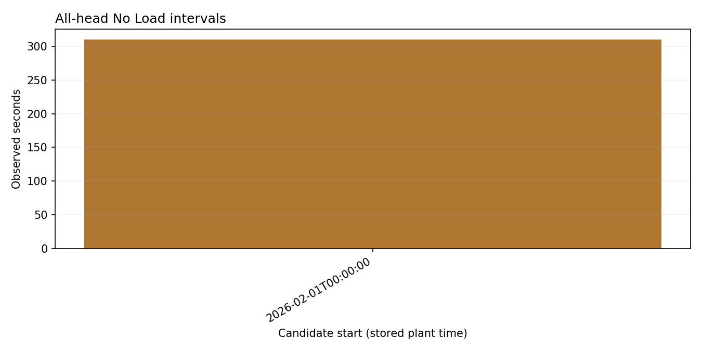

# Telemetry report

*Query:* Machine idle for machine DEMO from 2026-02-01T00:00:00 until 2026-02-01T00:06:40
*Generated:* 2026-10-09 01:51  |  *Planner:* rules  |  *Schema:* 1.0

## 1. Goal

Identify observed intervals with No Load on every head for the configured sustained duration.

## 2. Data used

- Pool `sample` from the **person_a_pool** source, 400 raw status readings across 2 heads.
- Window 2026-02-01T00:00:00 to 2026-02-01T00:06:39 (plant-local, timezone unconfirmed).
- Machines: DEMO.
- **Warning:** Idle candidates use raw status readings, not closure events. A missing poll, duplicate timestamp or other status breaks continuity. These candidates do not prove machine downtime or a physical cause.
- Filters requested: `machine_id=DEMO`, `start=2026-02-01T00:00:00`, `end=2026-02-01T00:06:40`.

## 3. Analyses executed

- `machine_idle` (agent: analytics) - n=400, 1.02 ms - ok
  - filters: machine_id=DEMO, start>=2026-02-01T00:00:00, end<2026-02-01T00:06:40, every head status decodes as No Load; uninterrupted 1s samples

## 4. Findings

**machine_idle**
- Raw status readings inspected: **400**; every head reported No Load on 310 of them.
- Continuity breaks: 0 timestamp gaps and 0 repeated timestamps.
- Found **1** all-head No Load interval(s) with at least 300 consecutive one-second readings.
- [2026-02-01T00:00:00, 2026-02-01T00:05:10): 310 observed seconds.
- This status pattern is an idle candidate; operating schedule and independent machine signals are needed to establish downtime.

## 5. Confidence and limits

- `machine_idle`: Intervals are continuous observed one-second slots with No Load on every head. Missing or repeated timestamps break runs. Status 2 or 3 is No Load; unrecognized codes are not. This is a status-based candidate, not proof of zero production, machine downtime, or a physical cause.
- Idle candidates use raw status readings, not closure events. A missing poll, duplicate timestamp or other status breaks continuity. These candidates do not prove machine downtime or a physical cause.

## 6. Next checks

- Compare candidate No Load intervals with the machine operating schedule and independent alarm or sensor logs before calling them downtime.

---

## Trace

1 tool call(s), 8 ms total.

| # | step | tool | n | ms | ok |
|---|------|------|---|----|----|
| 0 | plan |  |  |  | yes |
| 1 | load_pool |  |  |  | yes |
| 2 | tool_call | machine_idle | 400 | 1.02 | yes |
| 3 | validate |  |  |  | yes |

## Figures

