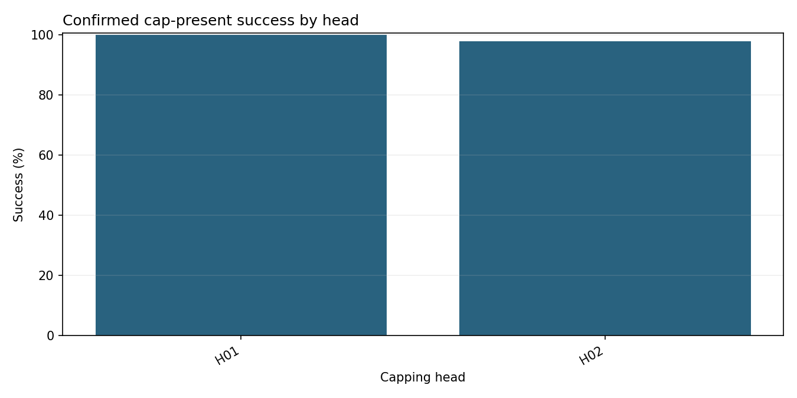

# Telemetry report

*Query:* Success rate per head for machine DEMO from 2026-02-01T00:00:00 until 2026-02-01T00:06:40
*Generated:* 2026-10-09 01:51  |  *Planner:* rules  |  *Schema:* 1.0

## 1. Goal

Describe observed-event KPIs with explicit denominators within the requested scope.

## 2. Data used

- Pool `sample` from the **person_a_pool** source, 798 closure events across 2 heads.
- Window 2026-02-01T00:00:01 to 2026-02-01T00:06:39 (plant-local, timezone unconfirmed).
- Machines: DEMO.
- Events loaded for the requested scope: 798 of 798 stored observed events in this pool.
- **Warning:** These are observed exact +1 closure events. count_delta=1 and inferred=False describe the supplied events. Counter discontinuities are not reconstructed, and total production completeness is not measured by this adapter.
- Filters requested: `machine_id=DEMO`, `start=2026-02-01T00:00:00`, `end=2026-02-01T00:06:40`.

## 3. Analyses executed

- `success_rate_per_head` (agent: kpi) - n=180, 3.54 ms - ok
  - filters: start>=2026-02-01T00:00:00, end<2026-02-01T00:06:40, machine_id=DEMO

## 4. Findings

**success_rate_per_head**
- 2 machine/head groups; sorted by identifiers, without ranking.
- **DEMO / H01**:
- Observed exact +1 events: **399**; confirmed cap-present: **90**; unknown cap presence: **0**.
- Cap-present success: **100.000000%** (90/90).
- Cap-present rejection flags: **0.000000%** (0/90).
- Rejection flags outside the cap-present population: **0**; unknown rejection flags: 0.
- No Load class: 309/399 observed events (77.443609%). Explicit cap absence: 309 events.
- Status-0 fraction of all observed events: 22.556391% (90/399).
- Legacy A non-No-Load success fraction: 100.000000% (90/90); this uses a different denominator.
- **DEMO / H02**:
- Observed exact +1 events: **399**; confirmed cap-present: **90**; unknown cap presence: **0**.
- Cap-present success: **97.777778%** (88/90).
- Cap-present rejection flags: **2.222222%** (2/90).
- Rejection flags outside the cap-present population: **0**; unknown rejection flags: 0.
- No Load class: 309/399 observed events (77.443609%). Explicit cap absence: 309 events.
- Status-0 fraction of all observed events: 22.055138% (88/399).
- Legacy A non-No-Load success fraction: 97.777778% (88/90); this uses a different denominator.

## 5. Confidence and limits

- `success_rate_per_head`: Rates describe selected observed exact +1 events, not total production. Cap-present rates exclude unknown cap presence; unknowns and rejects outside this population are reported separately. meta.n is the confirmed cap-present denominator. Torque finiteness does not filter KPI events. The legacy A non-No-Load fraction is separately labelled; A calculations are unchanged. These descriptive rates do not establish fault causes or engineering compliance. 0 machine/head groups have fewer than 30 cap-present observations; no head ranking or statistical significance claim is made.
- These are observed exact +1 closure events. count_delta=1 and inferred=False describe the supplied events. Counter discontinuities are not reconstructed, and total production completeness is not measured by this adapter.
- Every rate identifies its denominator. Unknown cap presence is not treated as confirmed cap absence or presence.

## 6. Next checks

- Review unknown status/cap-presence counts, sample sizes and observation coverage before comparing rates. These summaries do not establish machine stability or a fault cause.

---

## Trace

1 tool call(s), 14 ms total.

| # | step | tool | n | ms | ok |
|---|------|------|---|----|----|
| 0 | plan |  |  |  | yes |
| 1 | load_pool |  |  |  | yes |
| 2 | tool_call | success_rate_per_head | 180 | 3.54 | yes |
| 3 | validate |  |  |  | yes |

## Figures

