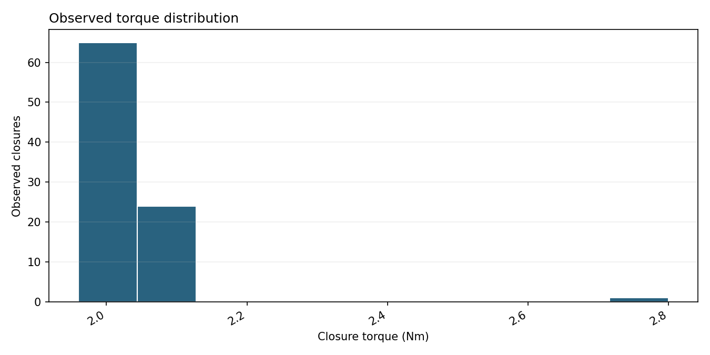

# Telemetry report

*Query:* Summarize torque and show its distribution with 10 bins for machine DEMO from 2026-02-01T00:00:00 until 2026-02-01T00:06:40 for head 1 for successful closures
*Generated:* 2026-10-09 01:51  |  *Planner:* rules  |  *Schema:* 1.0

## 1. Goal

Run torque_stats and torque_distribution within the explicitly requested event scope.

## 2. Data used

- Pool `sample` from the **person_a_pool** source, 90 closure events across 1 heads.
- Window 2026-02-01T00:05:10 to 2026-02-01T00:06:39 (plant-local, timezone unconfirmed).
- Machines: DEMO.
- Events loaded for the requested scope: 90 of 798 stored observed events in this pool.
- **Warning:** These are observed exact +1 closure events. count_delta=1 and inferred=False describe the supplied events. Counter discontinuities are not reconstructed, and total production completeness is not measured by this adapter.
- Filters requested: `bins=10`, `machine_id=DEMO`, `start=2026-02-01T00:00:00`, `end=2026-02-01T00:06:40`, `head_id=H01`, `status_filter=successful`.

## 3. Analyses executed

- `torque_stats` (agent: analytics) - n=90, 2.15 ms - ok
  - filters: status_filter='successful', start>=2026-02-01T00:00:00, end<2026-02-01T00:06:40, head_id in ['H01'], machine_id=DEMO, torque is non-null and finite
- `torque_distribution` (agent: analytics) - n=90, 2.72 ms - ok
  - filters: start>=2026-02-01T00:00:00, end<2026-02-01T00:06:40, head_id in ['H01'], machine_id=DEMO, status_filter='successful', torque is non-null and finite

## 4. Findings

**torque_stats**
- Finite torque observations: **90**.
- Mean: **2.02444 Nm**; minimum: **1.96 Nm**; maximum: **2.8 Nm**.
- Sample standard deviation (ddof=1): **0.0896424 Nm**.
- These summary statistics do not establish whether torque meets engineering limits.

**torque_distribution**
- Histogram: 90 finite observations in 10 bins.
- Bin-edge range: 1.96 to 2.8 Nm.
- Bin counts: [65, 24, 0, 0, 0, 0, 0, 0, 0, 1].

## 5. Confidence and limits

- These analyses may reuse the same observations. Their sample sizes must not be added to claim a count of distinct events.
- `torque_stats`: Statistics describe observed exact +1 closure events. Counter discontinuities are not reconstructed as closures. Standard deviation uses ddof=1.
- `torque_distribution`: Only supplied observed exact +1 events are analysed. Counter discontinuities are not reconstructed. Bins are left-inclusive and right-exclusive except the final bin, which includes its right edge. A histogram alone does not diagnose a fault.
- These are observed exact +1 closure events. count_delta=1 and inferred=False describe the supplied events. Counter discontinuities are not reconstructed, and total production completeness is not measured by this adapter.

## 6. Next checks

- Compare torque statistics with confirmed engineering limits before assessing acceptability.
- Review counter discontinuities separately; this report describes observed exact +1 events.
- Review observation coverage and process context before drawing operational conclusions.

---

## Trace

2 tool call(s), 18 ms total.

| # | step | tool | n | ms | ok |
|---|------|------|---|----|----|
| 0 | plan |  |  |  | yes |
| 1 | load_pool |  |  |  | yes |
| 2 | tool_call | torque_stats | 90 | 2.15 | yes |
| 3 | tool_call | torque_distribution | 90 | 2.72 | yes |
| 4 | validate |  |  |  | yes |

## Figures

